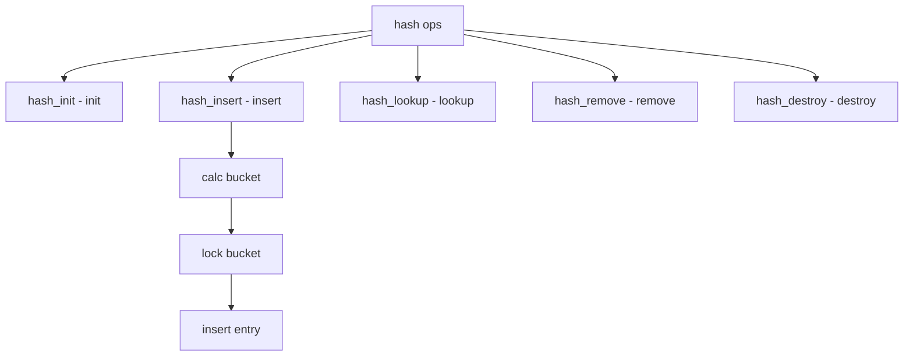

# Component: subr_hash.c

**Path:** `sys/kern/subr_hash.c`
**Type:** File
**Maps to:** `.discovery/sys/kern/subr_hash.md`

## Purpose

Hash table - kernel hash table implementation. Provides generic hash table with per-bucket locking using various lock types.

## Structure



## Key Functions

| Function | Purpose | Signature |
|----------|---------|-----------|
| `hashinit` | Init table | `struct hash *hashinit(int nel, struct lock_type *type, struct malloc_type *mtype, int flags)` |
| `hashdestroy` | Destroy | `void hashdestroy(struct hash *hp, struct lock_type *type, struct malloc_type *mtype)` |
| `hash_lookup` | Lookup | `void *hash_lookup(struct hash *hp, const void *key)` |
| `hash_insert` | Insert | `int hash_insert(struct hash *hp, void *elm, uintptr_t keyoff)` |
| `hash_remove` | Remove | `int hash_remove(struct hash *hp, void *elm)` |

## Hash Structure

```c
struct hash {
    struct hash_entry *h_entries;   // Entries
    uint32_t h_nentries;           // Num entries
    uint32_t h_mask;               // Mask
    uint32_t h_shift;              // Shift
    struct lock h_lock;            // Lock
};
```

## Hash Entry

```c
struct hash_entry {
    void *he_next;                // Next
    void *he_key;                 // Key
};
```

## Lock Types

| Lock | Description |
|------|-------------|
| `mtx` | Mutex |
| `rwlock` | Read-write lock |
| `sx` | Sharedexclusive |
| `rmlock` | Read-mostly lock |

## Flags

| Flag | Description |
|------|-------------|
| `HASH_NOLOCK` | No locking |
| `HASH_WAITOK` | Sleep ok |
| `HASH_NEVERWAIT` | No sleep |

## Features

| Feature | Description |
|---------|-------------|
| `per-bucket` | Per-bucket locks |
| `dynamic` | Resizable |
| `typed` | Type-safe |

## Includes

- `sys/hash.h` - Hash definitions
- `sys/malloc.h` - Memory allocation

## Depends On

- `sys/lock.h` - Locking primitives
- `sys/queue.h` - Queue definitions