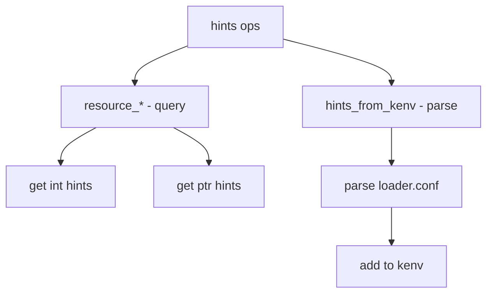

# Component: subr_hints.c

**Path:** `sys/kern/subr_hints.c`
**Type:** File
**Maps to:** `.discovery/sys/kern/subr_hints.md`

## Purpose

Device hints - parses kernel environment hints from loader.conf. Provides device resource hints like IRQ, memory addresses, and driver parameters.

## Structure



## Key Functions

| Function | Purpose | Signature |
|----------|---------|-----------|
| `resource_find` | Find | `int resource_find(const char **match, const char *name, ...)` |
| `resource_long_query` | Query long | `int resource_long_query(int match, ...)` |
| `resource_int` | Get int | `int resource_int(const char *name, int *result)` |
| `hints_from_kenv` | From kenv | `void hints_from_kenv(void)` |

## Fallback Modes

| Mode | Description |
|------|-------------|
| `FBACK_MDENV` | MD env |
| `FBACK_STENV` | Static env |
| `FBACK_STATIC` | Static hints |

## Hint Format

```
hint.driver.unit.attr=value
```

## Example Hints

| Hint | Description |
|------|-------------|
| `hint.acpi.0.rsdp=0x0` | ACPI RSDP |
| `hint.psm.0.flags=0x1` | PS/2 flags |

## Environment

| Source | Description |
|--------|-------------|
| `loader.conf` | Boot loader config |
| `kenv` | Kernel environment |

## Includes

- `sys/kenv.h` - Kernel environment
- `sys/bus.h` - Bus definitions

## Depends On

- `sys/kernel.h` - Kernel definitions