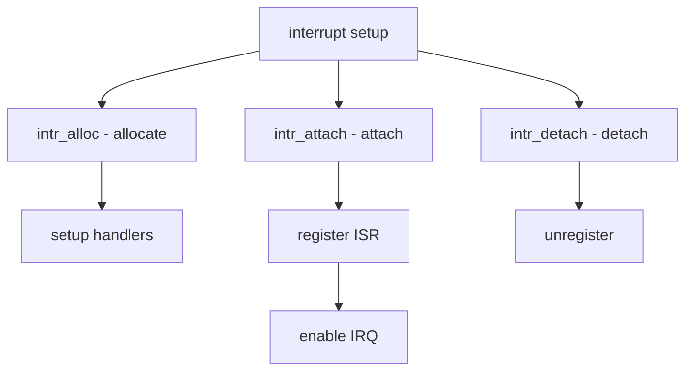

# Component: subr_intr.c

**Path:** `sys/kern/subr_intr.c`
**Type:** File
**Maps to:** `.discovery/sys/kern/subr_intr.md`

## Purpose

New-style interrupt framework - provides generic interrupt handling for devices. Supports MSI, MSI-X, ISA, and GPIO interrupts.

## Structure



## Key Functions

| Function | Purpose | Signature |
|----------|---------|-----------|
| `intr_alloc` | Allocate | `int intr_alloc(device_t dev, struct intr_irqsrc **isrcp, ...)` |
| `intr_attach` | Attach | `int intr_attach(struct intr_irqsrc *isrc)` |
| `intr_detach` | Detach | `int intr_detach(struct intr_irqsrc *isrc)` |
| `intr_event` | Event handler | `int intr_event_handler(struct intr_event *ie, struct trapframe *tf)` |
| `intr_setup` | Setup | `int intr_setup(struct intr_irqsrc *isrc, ...)` |

## Interrupt Source

```c
struct intr_irqsrc {
    uint32_t isrc_flags;         // Flags
    uint32_t isrc_irq;           // IRQ
    const char *isrc_name;        // Name
    void (*isrc_handler)(struct intr_irqsrc *isrc, struct trapframe *tf);
};
```

## Event Structure

```c
struct intr_event {
    TAILQ_ENTRY(intr_event) ie_list;    // List
    struct intr_irqsrc *ie_irqsrc;     // Source
    TAILQ_HEAD(, intr_handler) ie_handlers; // Handlers
    int ie_flags;                        // Flags
};
```

## Handler Structure

```c
struct intr_handler {
    TAILQ_ENTRY(intr_handler) ih_link; // Link
    driver_filter_t *ih_filter;         // Filter
    driver_intr_t *ih_handler;          // Handler
    void *ih_argument;                  // Arg
    int ih_flags;                       // Flags
};
```

## Types

| Type | Description |
|------|-------------|
| `INTR_TYPE_TTY` | TTY |
| `INTR_TYPE_BIO` | Block I/O |
| `INTR_TYPE_NET` | Network |
| `INTR_TYPE_CAM` | CAM |
| `INTR_TYPE_MISC` | Misc |

## Flags

| Flag | Description |
|------|-------------|
| `INTR_EXCL` | Exclusive |
| `INTR_MPSAFE` | MP safe |
| `INTR_ENTROPY` | Entropy |

## Includes

- `sys/interrupt.h` - Interrupt definitions
- `sys/intr.h` - Intr definitions

## Depends On

- `sys/bus.h` - Bus definitions
- `sys/lock.h` - Locking