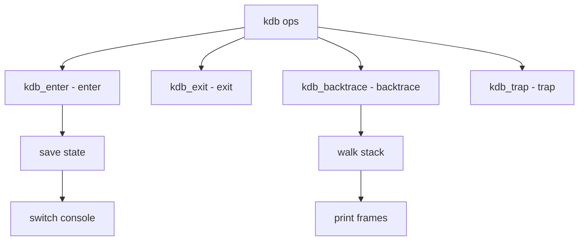

# Component: subr_kdb.c

**Path:** `sys/kern/subr_kdb.c`
**Type:** File
**Maps to:** `.discovery/sys/kern/subr_kdb.md`

## Purpose

Kernel debugger - KDB interface and backend management. Provides debugger entry points, backtrace, and debugger backend selection.

## Structure



## Key Functions

| Function | Purpose | Signature |
|----------|---------|-----------|
| `kdb_enter` | Enter KDB | `void kdb_enter(enum kdbwhy why, const char *fmt, ...)` |
| `kdb_exit` | Exit KDB | `void kdb_exit(void)` |
| `kdb_backtrace` | Backtrace | `void kdb_backtrace(int count)` |
| `kdb_trap` | Trap handler | `int kdb_trap(int type, int code, struct trapframe *tf)` |
| `kdb_dbbe_init` | Init backend | `int kdb_dbbe_init(const char *name)` |
| `kdb_jumpbuf` | Set jump | `void kdb_jumpbuf(void *buf)` |

## Why Codes

| Why | Description |
|-----|-------------|
| `KDB_WHY_UNSET` | Unset |
| `KDB_WHY_BREAK` | Break |
| `KDB_WHY_PANIC` | Panic |
| `KDB_WHY_TRAP` | Trap |
| `KDB_WHY_WATCHDOG` | Watchdog |

## KDB Backend

```c
struct kdb_dbbe {
    const char *name;               // Name
    int (*init)(void);            // Init
    int (*exit)(void);            // Exit
    int (*print)(const char *);   // Print
    int (*read)(int, void *, int); // Read
    int (*write)(int, void *, int); // Write
};
```

## Variables

| Variable | Description |
|----------|-------------|
| `kdb_active` | KDB active flag |
| `kdb_jmpbufp` | Jump buffer |
| `kdb_dbbe` | Current backend |

## Backtrace

| Function | Description |
|----------|-------------|
| `kdb_backtrace` | Show stack |
| `kdb_stacks` | Show all |

## Includes

- `sys/kdb.h` - KDB definitions
- `machine/kdb.h` - Machine KDB

## Depends On

- `sys/cons.h` - Console
- `machine/pcb.h` - PCB