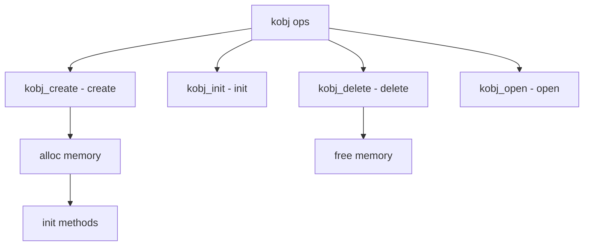

# Component: subr_kobj.c

**Path:** `sys/kern/subr_kobj.c`
**Type:** File
**Maps to:** `.discovery/sys/kern/subr_kobj.md`

## Purpose

Kernel object system - generic object framework for kernel. Provides method dispatch, object allocation, and class-based OOP for kernel subsystems.

## Structure



## Key Functions

| Function | Purpose | Signature |
|----------|---------|-----------|
| `kobj_create` | Create | `struct kobj *kobj_create(struct kobj_class *cls, struct malloc_type *mtype, int mflags)` |
| `kobj_init` | Init | `int kobj_init(struct kobj *obj, struct kobj_class *cls)` |
| `kobj_delete` | Delete | `void kobj_delete(struct kobj *obj, struct malloc_type *mtype)` |
| `kobj_open` | Open | `struct kobj *kobj_open(struct kobj_class *cls, ...)` |
| `kobj_error` | Get error | `int kobj_error(struct kobj *obj)` |

## Kobj Structure

```c
struct kobj {
    struct kobj_class *k_class;    // Class
    TAILQ_ENTRY(kobj) k_link;     // Link
    int k_id;                      // ID
};
```

## Kobj Class

```c
struct kobj_class {
    const char *name;              // Name
    struct kobj_class *super;     // Super
    size_t size;                   // Size
    kobj_method_t *methods;       // Methods
    int refs;                      // Refs
};
```

## Kobj Method

```c
typedef void *(*kobj_method_t)(struct kobj *obj, ...);
```

## Stats

| Stat | Description |
|------|-------------|
| `kobj_hits` | Lookup hits |
| `kobj_misses` | Lookup misses |

## Includes

- `sys/kobj.h` - Kernel object definitions

## Depends On

- `sys/malloc.h` - Memory allocation
- `sys/lock.h` - Locking