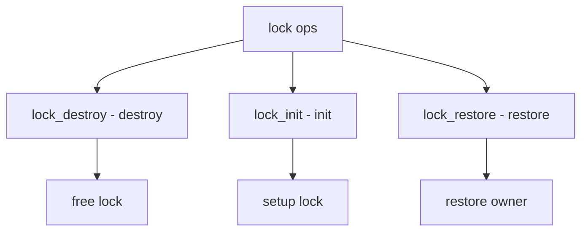

# Component: subr_lock.c

**Path:** `sys/kern/subr_lock.c`
**Type:** File
**Maps to:** `.discovery/sys/kern/subr_lock.md`

## Purpose

Lock object management - maintains lock_object structures for all kernel locks. Provides lock profiling and debugging support.

## Structure



## Key Functions

| Function | Purpose | Signature |
|----------|---------|-----------|
| `lock_init` | Init lock | `void lock_init(struct lock_object *lock, ...)` |
| `lock_destroy` | Destroy lock | `void lock_destroy(struct lock_object *lock)` |
| `lock_restore` | Restore lock | `void lock_restore(struct lock_object *lock)` |
| `lock_set_class` | Set class | `void lock_set_class(struct lock_object *lock, ...)` |
| `lock_profile_obtain` | Profile get | `void lock_profile_obtain(...)` |
| `lock_profile_release` | Profile put | `void lock_profile_release(...)` |

## Lock Object

```c
struct lock_object {
    const char *lo_name;        // Name
    struct lock_type *lo_type;  // Type
    uintptr_t lo_flags;         // Flags
    uintptr_t lo_data;          // Data
    void (*lo_show)(struct lock_object *lock);
};
```

## Lock Types

| Type | Description |
|------|-------------|
| `LO_CLASS` | Class |
| `LO_NEW` | New |
| `LO_RECURSABLE` | Recursive |
| `LO_SLEEPABLE` | Sleepable |

## Flags

| Flag | Description |
|------|-------------|
| `LK_FLAG_NONE` | None |
| `LK_FLAG_UNUSED` | Unused |
| `LK_FLAG_TIMESTAMP` | Timestamp |

## Profile Data

| Field | Description |
|-------|-------------|
| `lp_lock` | Lock pointer |
| `lp_count` | Acquire count |
| `lp_waitwait` | Wait time |

## Includes

- `sys/lock.h` - Lock definitions
- `sys/lock_profile.h` - Profile

## Depends On

- `sys/mutex.h` - Mutex
- `sys/sx.h` - SX lock