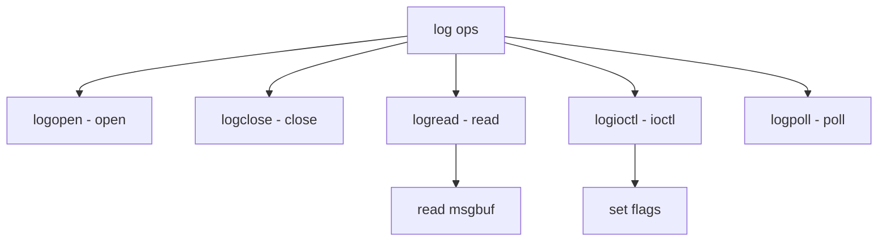

# Component: subr_log.c

**Path:** `sys/kern/subr_log.c`
**Type:** File
**Maps to:** `.discovery/sys/kern/subr_log.md`

## Purpose

Kernel log device - /dev/log character device for kernel message logging. Provides device interface to kernel message buffer.

## Structure

## Key Functions

| Function | Purpose | Signature |
|----------|---------|-----------|
| `logopen` | Open | `int logopen(struct cdev *dev, int flags, int mode, struct thread *td)` |
| `logclose` | Close | `int logclose(struct cdev *dev, int flags, int mode, struct thread *td)` |
| `logread` | Read | `int logread(struct cdev *dev, struct uio *uio, int flag)` |
| `logioctl` | Ioctl | `int logioctl(struct cdev *dev, u_long com, caddr_t data, int flags, struct thread *td)` |
| `logpoll` | Poll | `int logpoll(struct cdev *dev, int events, struct thread *td)` |

## Device

| Device | Description |
|--------|-------------|
| `/dev/log` | Kernel log |

## Ioctls

| Ioctl | Description |
|-------|-------------|
| `FIOCGETFLAGS` | Get flags |
| `FIOSETFLAGS` | Set flags |
| `FIONREAD` | Bytes avail |

## Flags

| Flag | Description |
|------|-------------|
| `LOG_ASYNC` | Async I/O |

## Priority

| Priority | Description |
|----------|-------------|
| `LOG_RDPRI` | Read priority |

## Read Behavior

| Behavior | Description |
|----------|-------------|
| `blocking` | Block until data |
| `nonblock` | Return EWOULDBLOCK |

## Includes

- `sys/msgbuf.h` - Message buffer
- `sys/ttycom.h` - TTY commands

## Depends On

- `sys/conf.h` - Conf definitions