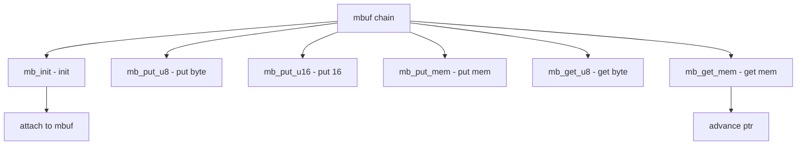

# Component: subr_mchain.c

**Path:** `sys/kern/subr_mchain.c`
**Type:** File
**Maps to:** `.discovery/sys/kern/subr_mchain.md`

## Purpose

Mbuf chain - mbuf chain manipulation routines. Provides convenience functions for building and parsing mbuf chains.

## Structure



## Key Functions

| Function | Purpose | Signature |
|----------|---------|-----------|
| `mb_init` | Init | `int mb_init(struct mbchain *mbp)` |
| `mb_initm` | Init with m | `int mb_initm(struct mbchain *mbp, struct mbuf *m)` |
| `mb_done` | Done | `void mb_done(struct mbchain *mbp)` |
| `mb_put_u8` | Put byte | `int mb_put_u8(struct mbchain *mbp, uint8_t val)` |
| `mb_put_u16` | Put 16 | `int mb_put_u16(struct mbchain *mbp, uint16_t val)` |
| `mb_put_u32` | Put 32 | `int mb_put_u32(struct mbchain *mbp, uint32_t val)` |
| `mb_put_mem` | Put mem | `int mb_put_mem(struct mbchain *mbp, void *buf, size_t len)` |
| `mb_get_u8` | Get byte | `int mb_get_u8(struct mbchain *mbp, uint8_t *val)` |
| `mb_get_u16` | Get 16 | `int mb_get_u16(struct mbchain *mbp, uint16_t *val)` |
| `mb_get_mem` | Get mem | `int mb_get_mem(struct mbchain *mbp, void *buf, size_t len)` |

## MBchain Structure

```c
struct mbchain {
    struct mbuf *mb_top;        // Top
    struct mbuf *mb_cur;       // Current
    int mb_flags;              // Flags
    caddr_t mb_data;           // Data
    int mb_cont;               // Cont
};
```

## MDchain Structure

```c
struct mdchain {
    struct mbuf *md_top;        // Top
    struct mbuf *md_cur;       // Current
    int md_flags;              // Flags
    caddr_t md_data;           // Data
    int md_off;                // Offset
};
```

## Flags

| Flag | Description |
|------|-------------|
| `M_DONTWAIT` | Non-blocking |
| `M_WAIT` | Blocking |

## Use Cases

| Use | Description |
|-----|-------------|
| `NFS` | NFS requests |
| `SMB` | SMB requests |

## Includes

- `sys/mbuf.h` - Mbuf definitions
- `sys/mchain.h` - Chain definitions