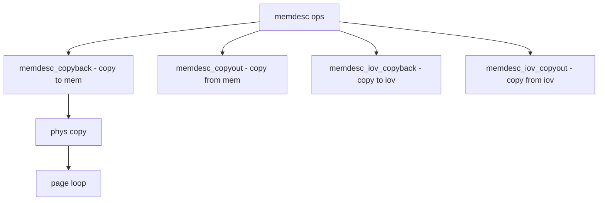

# Component: subr_memdesc.c

**Path:** `sys/kern/subr_memdesc.c`
**Type:** File
**Maps to:** `.discovery/sys/kern/subr_memdesc.md`

## Purpose

Memory descriptors - abstract memory region descriptions for DMA and other operations. Provides copy, fill, and I/O operations on physical/virt addresses.

## Structure



## Key Functions

| Function | Purpose | Signature |
|----------|---------|-----------|
| `phys_copyback` | Copy to phys | `void phys_copyback(vm_paddr_t pa, int off, int size, const void *src)` |
| `phys_copyout` | Copy from phys | `void phys_copyout(void *dst, vm_paddr_t pa, int size)` |
| `memdesc_copyback` | Copy to desc | `void memdesc_copyback(struct memdesc *mem, int off, size_t size, const void *src)` |
| `memdesc_copyout` | Copy from desc | `void memdesc_copyout(struct memdesc *mem, void *dst, size_t size)` |
| `memdesc_iov_copyback` | Copy to iov | `int memdesc_iov_copyback(struct memdesc *mem, struct iovec *iov, int iovcnt, size_t *lenp)` |
| `memdesc_iov_copyout` | Copy from iov | `int memdesc_iov_copyout(struct memdesc *mem, struct iovec *iov, int iovcnt, size_t *lenp)` |

## Memdesc Structure

```c
struct memdesc {
    union {
        vm_offset_t vaddr;      // Virtual
        vm_paddr_t paddr;       // Physical
    } u;
    size_t size;                 // Size
    int flags;                   // Flags
};
```

## Flags

| Flag | Description |
|------|-------------|
| `MEMDESC_F_KERNEL` | Kernel |
| `MEMDESC_F_USER` | User |
| `MEMDESC_F_PHYS` | Physical |

## Operations

| Op | Description |
|----|-------------|
| `copyback` | To device |
| `copyout` | From device |
| `iov` | Vector I/O |

## Includes

- `sys/memdesc.h` - Memory descriptor definitions

## Depends On

- `vm/vm.h` - VM
- `vm/pmap.h` - Physical map