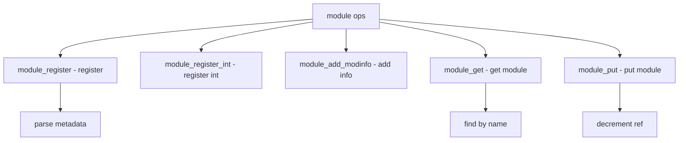

# Component: subr_module.c

**Path:** `sys/kern/subr_module.c`
**Type:** File
**Maps to:** `.discovery/sys/kern/subr_module.md`

## Purpose

Kernel module support - module loading, dependency resolution, and preloaded module handling. Supports dynamic kernel module loading via kldload.

## Structure



## Key Functions

| Function | Purpose | Signature |
|----------|---------|-----------|
| `module_register` | Register | `int module_register(struct module *mod, ...)` |
| `module_register_int` | Reg interface | `int module_register_int(module_t mod, ...) ` |
| `module_get` | Get module | `module_t module_get(const char *name)` |
| `module_put` | Put module | `void module_put(module_t mod)` |
| `module_add_modinfo` | Add info | `int module_add_modinfo(struct module *mod, ...)` |
| `module_init` | Init | `int module_init(const char *name, ...)` |
| `module_shutdown` | Shutdown | `void module_shutdown(void)` |

## Module Structure

```c
struct module {
    TAILQ_ENTRY(module) link;       // Link
    TAILQ_ENTRY(module) flink;      // File link
    const char *name;               // Name
    int refs;                       // References
    modeventhand_t handler;         // Handler
    void *arg;                      // Argument
    struct mod_depend *deps;        // Dependencies
    int version;                    // Version
};
```

## Modevent

| Type | Description |
|------|-------------|
| `MOD_LOAD` | Load |
| `MOD_UNLOAD` | Unload |
| `MOD_SHUTDOWN` | Shutdown |

## Preload

| Variable | Description |
|---------|-------------|
| `preload_addr_relocate` | Relocation address |
| `preload_metadata` | Metadata pointer |
| `preload_kmdp` | Kernel metadata |

## Dependencies

| Field | Description |
|-------|-------------|
| `mod_depend` | Dependency info |
| `md_ver_minimum` | Min version |
| `md_ver_preferred` | Preferred |

## Module Types

| Type | Description |
|------|-------------|
| `MODTYPE` | Binary type |
| `KERNTYPE` | Kernel type |
| `MODTYPE_OBJ` | Object type |

## Includes

- `sys/linker.h` - Linker definitions
- `machine/metadata.h` - Metadata

## Depends On

- `sys/kernel.h` - Kernel definitions