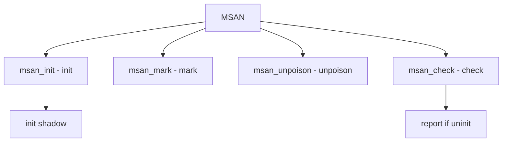

# Component: subr_msan.c

**Path:** `sys/kern/subr_msan.c`
**Type:** File
**Maps to:** `.discovery/sys/kern/subr_msan.md`

## Purpose

Memory sanitizer (MSAN) - detects use of uninitialized memory. Tracks initialization state of memory.

## Structure

## Key Functions

| Function | Purpose | Signature |
|----------|---------|-----------|
| `msan_init` | Init | `void msan_init(void)` |
| `msan_mark` | Mark init | `void msan_mark(const void *addr, size_t size, int val)` |
| `msan_unpoison` | Unpoison | `void msan_unpoison(const void *addr, size_t size)` |
| `msan_poison` | Poison | `void msan_poison(const void *addr, size_t size)` |
| `msan_load_u8` | Load check | `uint8_t msan_load_u8(const uint8_t *addr)` |

## MSAN State

| State | Description |
|-------|-------------|
| `0` | Initialized |
| `non-zero` | Uninitialized |

## Shadow Memory

| Concept | Description |
|---------|-------------|
| `shadow` | Shadow state |
| `origin` | Origin track |

## Interceptors

| Function | Description |
|----------|-------------|
| `msan_syscalls` | Syscall hooks |
| `msan_device` | Device hooks |

## Use Cases

| Use | Description |
|-----|-------------|
| `debug` | Bug detection |
| `testing` | Validation |

## Includes

- `sys/msan.h` - MSAN definitions