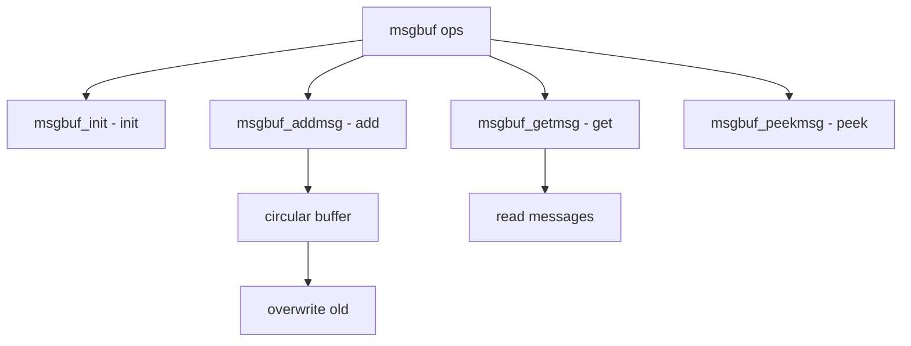

# Component: subr_msgbuf.c

**Path:** `sys/kern/subr_msgbuf.c`
**Type:** File
**Maps to:** `.discovery/sys/kern/subr_msgbuf.md`

## Purpose

Message buffer - kernel message buffer for console output. Provides circular message buffer used for kernel printf output.

## Structure



## Key Functions

| Function | Purpose | Signature |
|----------|---------|-----------|
| `msgbuf_init` | Init | `void msgbuf_init(struct msgbuf *mbp, void *buf, size_t size)` |
| `msgbuf_addmsg` | Add msg | `int msgbuf_addmsg(struct msgbuf *mbp, int pri, const char *msg, size_t len)` |
| `msgbuf_getmsg` | Get msg | `int msgbuf_getmsg(struct msgbuf *mbp, struct msgbarrier *mbarrier, ...)` |
| `msgbuf_peekmsg` | Peek | `int msgbuf_peekmsg(struct msgbuf *mbp, const char **msgp, size_t *lenp, int *prip)` |
| `msgbuf_cksum` | Checksum | `u_int msgbuf_cksum(struct msgbuf *mbp)` |

## Msgbuf Structure

```c
struct msgbuf {
    char *msg_ptr;              // Buffer
    size_t msg_size;            // Size
    u_int msg_seq;              // Sequence
    u_int msg_wseq;             // Write seq
    u_int msg_rseq;             // Read seq
    u_int msg_cksum;            // Checksum
    int msg_flags;              // Flags
};
```

## Message Header

```c
struct msgheader {
    u_int mh_seq;               // Sequence
    int mh_pri;                 // Priority
    size_t mh_len;              // Length
};
```

## Priority Levels

| Priority | Description |
|----------|-------------|
| `LOG_ALERT` | Alert |
| `LOG_CRIT` | Critical |
| `LOG_ERR` | Error |
| `LOG_WARNING` | Warning |
| `LOG_NOTICE` | Notice |
| `LOG_INFO` | Info |
| `LOG_DEBUG` | Debug |

## Flags

| Flag | Description |
|------|-------------|
| `MSG_HIWAT` | High water |
| `MSG_ERR` | Error |

## Sysctl

| Node | Description |
|------|-------------|
| `kern.msgbuf_show_timestamp` | Show timestamps |

## Includes

- `sys/msgbuf.h` - Message buffer definitions

## Depends On

- `sys/lock.h` - Locking