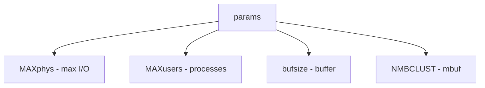

# Component: subr_param.c

**Path:** `sys/kern/subr_param.c`
**Type:** File
**Maps to:** `.discovery/sys/kern/subr_param.md`

## Purpose

System parameters - kernel configuration constants and derived values. Sets MAXphys, MAXusers, and other kernel tuning parameters.

## Structure

## Key Constants

| Constant | Description | Default |
|----------|-------------|---------|
| `MAXphys` | Max I/O size | 65536 |
| `MAXusers` | Max users | 384 |
| `NMBCLUST` | Mbuf clusters | 512 |
| `MSIZE` | Mbuf size | 256 |
| `CLSIZE` | Cluster size | 2 |

## Computed Values

| Value | Formula |
|-------|---------|
| `nbuf` | Based on MAXusers |
| `bufcache` | Buffer cache |
| `maxproc` | Max processes |
| `maxfiles` | Max open files |

## Buffer Parameters

| Param | Description |
|-------|-------------|
| `BUFSIZE` | Buffer size |
| `MAXBSIZE` | Max block size |
| `MAXBCACHEBUF` | Max bcached buf |

## Mbuf Parameters

| Param | Description |
|-------|-------------|
| `MSIZE` | Mbuf size |
| ` MCLBYTES` | Cluster bytes |
| `NMBCLUSTERS` | Mbuf clusters |

## Tuning

| Tuning | Description |
|--------|-------------|
| `opt_maxphys` | Override MAXphys |
| `opt_maxusers` | Override MAXusers |

## Includes

- `sys/param.h` - Parameters
- `vm/vm_param.h` - VM parameters

## Depends On

- `sys/buf.h` - Buffer defines