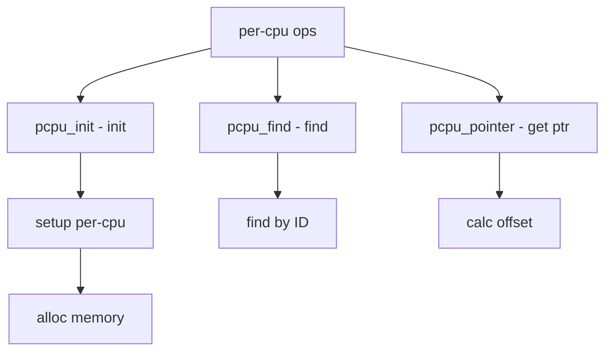

# Component: subr_pcpu.c

**Path:** `sys/kern/subr_pcpu.c`
**Type:** File
**Maps to:** `.discovery/sys/kern/subr_pcpu.md`

## Purpose

Per-CPU data - machine-independent per-CPU data support. Provides access to per-CPU variables that are actually stored per-CPU to avoid cache line bouncing.

## Structure



## Key Functions

| Function | Purpose | Signature |
|----------|---------|-----------|
| `pcpu_init` | Init PCPU | `void pcpu_init(void *tcpu, int cpuid, size_t size)` |
| `pcpu_find` | Find PCPU | `struct pcpu *pcpu_find(int cpuid)` |
| `pcpu_pointer` | Get pointer | `void *pcpu_pointer(struct thread *td)` |

## PCPU Structure

```c
struct pcpu {
    int pc_cpuid;                 // CPU ID
    struct thread *pc_curthread; // Current thread
    struct proc *pc_proc;         // Current proc
    u_int pc_ipi_cnt;            // IPI count
    struct zone *pc_curpcpu_zone; // Zone
    struct vmmeter pc_vmmeter;   // VM meter
    struct pcpu *pc_next;        // Next
    char pc_dynamic[0];          // Dynamic
};
```

## Macros

| Macro | Description |
|-------|-------------|
| `CPU_GET` | Get CPU set |
| `CPU_SET` | Set CPU |
| `CPU_SETAT` | Set at CPU |
| `CPU_ISSET` | Test CPU |

## Per-CPU Access

| Access | Description |
|--------|-------------|
| `curcpu` | Current CPU |
| `curthread` | Current thread |
| `curproc` | Current proc |

## PCPU Setup

| Phase | Description |
|-------|-------------|
| `SI_SUB_CPU` | Early init |
| `SI_SUB_CPU` | Late init |

## Features

| Feature | Description |
|---------|-------------|
| `dynamic` | Dynamic allocation |
| `static` | Static per-CPU |

## Includes

- `sys/pcpu.h` - PCPU definitions
- `sys/smp.h` - SMP definitions

## Depends On

- `sys/lock.h` - Locking