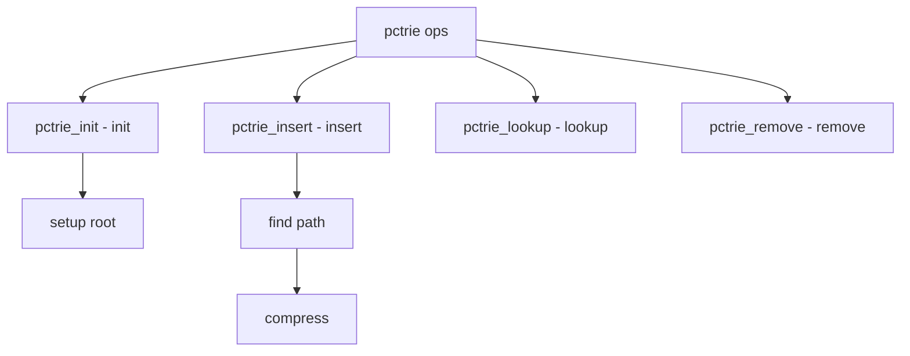

# Component: subr_pctrie.c

**Path:** `sys/kern/subr_pctrie.c`
**Type:** File
**Maps to:** `.discovery/sys/kern/subr_pctrie.md`

## Purpose

PCTrie - Path-Compressed Radix Trie. Provides efficient radix tree operations with path compression for address lookups.

## Structure



## Key Functions

| Function | Purpose | Signature |
|----------|---------|-----------|
| `pctrie_init` | Init | `void pctrie_init(struct pctrie *pt)` |
| `pctrie_insert` | Insert | `int pctrie_insert(struct pctrie *pt, uintptr_t key, void *val)` |
| `pctrie_lookup` | Lookup | `void *pctrie_lookup(struct pctrie *pt, uintptr_t key)` |
| `pctrie_remove` | Remove | `int pctrie_remove(struct pctrie *pt, uintptr_t key)` |
| `pctrie_range` | Range | `void *pctrie_range(struct pctrie *pt, uint64_t start, uint64_t end)` |

## PCTrie Structure

```c
struct pctrie {
    pctrie_node_t *pt_root;    // Root
};
```

## Node Structure

```c
struct pctrie_node {
    uint64_t pn_key;          // Key
    uint64_t pn_start;       // Start
    void *pn_child[2];       // Children
};
```

## Properties

| Property | Description |
|----------|-------------|
| `path-compressed` | Skip null branches |
| `radix` | Direct value lookup |
| `lock-free` | Safe memory reclamation |

## Use Cases

| Use | Description |
|-----|-------------|
| `vm_map` | VM address entries |
| `rangeset` | Range sets |

## Includes

- `sys/pctrie.h` - PCTrie definitions

## Depends On

- `sys/smr.h` - Safe memory reclamation