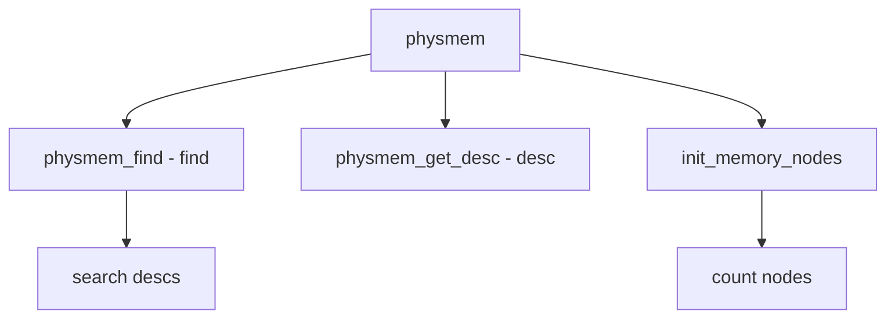

# Component: subr_physmem.c

**Path:** `sys/kern/subr_physmem.c`
**Type:** File
**Maps to:** `.discovery/sys/kern/subr_physmem.md`

## Purpose

Physical memory - describes and initializes physical memory. Provides physmem desc and memory node detection.

## Structure



## Key Functions

| Function | Purpose | Signature |
|----------|---------|-----------|
| `physmem_find` | Find range | `int physmem_find(const char *kind, vm_paddr_t *base, vm_size_t *size)` |
| `physmem_get_desc` | Get desc | `struct mem_section *physmem_get_desc(int mc)` |
| `init_memory_nodes` | Init nodes | `void init_memory_nodes(void)` |
| `physmem_numa_node` | Get node | `int physmem_numa_node(vm_paddr_t pa)` |

## Physical Memory Desc

```c
struct physmem_desc {
    vm_paddr_t start;           // Start
    vm_paddr_t end;             // End
    int node;                   // NUMA node
    int flags;                  // Flags
};
```

## Flags

| Flag | Description |
|------|-------------|
| `PMEM_NOTE` | Not present |
| `PMEM_HOTPLUG` | Hot-plugged |

## Memory Nodes

| Node | Description |
|------|-------------|
| `Numa` | NUMA node |
| `node` | Memory node |

## Includes

- `sys/physmem.h` - Physical memory definitions

## Depends On

- `vm/vm_page.h` - VM page
- `machine/md_var.h` - MD variables