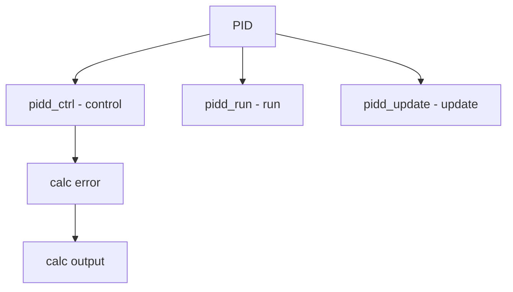

# Component: subr_pidctrl.c

**Path:** `sys/kern/subr_pidctrl.c`
**Type:** File
**Maps to:** `.discovery/sys/kern/subr_pidctrl.md`

## Purpose

PID controller - Proportional-Integral-Derivative control. Provides feedback control for system parameters like frequency, temperature, etc.

## Structure



## Key Functions

| Function | Purpose | Signature |
|----------|---------|-----------|
| `pidctrl_init` | Init | `void pidctrl_init(struct pidctrl *pc, int interval, int setpoint, int bound, int Kpd, int Kid, int Kdd)` |
| `pidctrl_init_sysctl` | Init sysctl | `void pidctrl_init_sysctl(struct pidctrl *pc, struct sysctl_oid_list *parent)` |
| `pidd_ctrl` | Control | `int pidd_ctrl(struct pidctrl *pc, int current)` |
| `pidd_update` | Update | `void pidd_update(struct pidctrl *pc, int interval)` |

## PID Structure

```c
struct pidctrl {
    int pc_setpoint;           // Target
    int pc_interval;           // Interval
    int pc_error;              // Error
    int pc_olderror;          // Old error
    int pc_integral;          // Integral
    int pc_derivative;        // Derivative
    int pc_Kpd;               // Kp
    int pc_Kid;               // Ki
    int pc_Kdd;               // Kd
    int pc_bound;             // Bound
};
```

## Gain Parameters

| Param | Description |
|-------|-------------|
| `Kpd` | Proportional |
| `Kid` | Integral |
| `Kdd` | Derivative |

## Use Cases

| Use | Description |
|-----|-------------|
| `sched` | Scheduler tuning |
| `thermal` | Temperature |
| `network` | Bandwidth |

## Includes

- `sys/pidctrl.h` - PID definitions