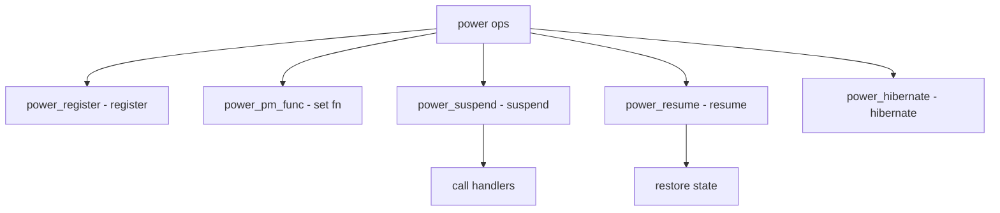

# Component: subr_power.c

**Path:** `sys/kern/subr_power.c`
**Type:** File
**Maps to:** `.discovery/sys/kern/subr_power.md`

## Purpose

Power management - system power state management (standby, suspend, hibernate). Provides power state transitions and event handling.

## Structure



## Key Functions

| Function | Purpose | Signature |
|----------|---------|-----------|
| `power_register` | Register | `int power_register(power_pm_fn_t fn, void *arg)` |
| `power_pm_func` | Set func | `void power_pm_func(power_pm_fn_t fn, void *arg)` |
| `power_suspend` | Suspend | `int power_suspend(enum power_stype stype)` |
| `power_resume` | Resume | `int power_resume(enum power_stype stype)` |
| `power_hibernate` | Hibernate | `int power_hibernate(void)` |
| `power_name_to_stype` | Name to type | `enum power_stype power_name_to_stype(const char *name)` |

## Power States

| State | Description |
|-------|-------------|
| `POWER_STYPE_STANDBY` | Standby |
| `POWER_STYPE_SUSPEND` | Suspend to RAM |
| `POWER_STYPE_HIBERNATE` | Hibernation |

## PM Types

| Type | Description |
|------|-------------|
| `POWER_PM_TYPE_NONE` | None |
| `POWER_PM_TYPE_ACPI` | ACPI |

## PM Function

```c
typedef int (*power_pm_fn_t)(void *arg, enum power_stype stype, int wake);
```

## Events

| Event | Description |
|-------|-------------|
| `power_suspend` | Suspend event |
| `power_resume` | Resume event |

## Variables

| Variable | Description |
|----------|-------------|
| `power_standby_stype` | Standby type |
| `power_suspend_stype` | Suspend type |
| `power_hibernate_stype` | Hibernate type |

## Includes

- `sys/power.h` - Power definitions

## Depends On

- `sys/eventhandler.h` - Events
- `sys/taskqueue.h` - Task queues