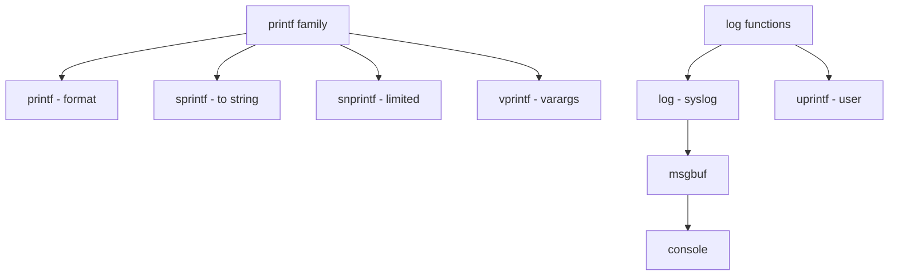

# Component: subr_prf.c

**Path:** `sys/kern/subr_prf.c`
**Type:** File
**Maps to:** `.discovery/sys/kern/subr_prf.md`

## Purpose

Printf and logging - kernel printf, sprintf, and syslog implementation. Provides kernel formatted output functions and logging infrastructure.

## Structure

## Key Functions

| Function | Purpose | Signature |
|----------|---------|-----------|
| `printf` | Print | `int printf(const char *fmt, ...)` |
| `sprintf` | To string | `int sprintf(char *buf, const char *fmt, ...)` |
| `snprintf` | Limited | `int snprintf(char *buf, size_t len, const char *fmt, ...)` |
| `vprintf` | Varargs | `int vprintf(const char *fmt, va_list ap)` |
| `vsnprintf` | Varargs lim | `int vsnprintf(char *buf, size_t len, const char *fmt, va_list ap)` |
| `uprintf` | User print | `void uprintf(const char *fmt, ...)` |
| `log` | Syslog | `void log(int level, const char *fmt, ...)` |
| `kprintf` | Kernel printf | `int kprintf(const char *fmt, ...)` |

## Format Specifiers

| Spec | Description |
|------|-------------|
| `%d` | Decimal |
| `%u` | Unsigned |
| `%x` | Hex |
| `%p` | Pointer |
| `%s` | String |
| `%c` | Char |
| `%ld` | Long |
| `%lld` | Long long |
| `%jx` | intmax_t |

## Log Levels

| Level | Description |
|-------|-------------|
| `LOG_EMERG` | Emergency |
| `LOG_ALERT` | Alert |
| `LOG_CRIT` | Critical |
| `LOG_ERR` | Error |
| `LOG_WARNING` | Warning |
| `LOG_NOTICE` | Notice |
| `LOG_INFO` | Info |
| `LOG_DEBUG` | Debug |

## Flags

| Flag | Description |
|------|-------------|
| `PRINTF_SAVECONTEXT` | Save ctx |
| `PRINTF_PUTCHAR` | Putchar |

## Includes

- `sys/syslog.h` - Syslog definitions

## Depends On

- `sys/msgbuf.h` - Message buffer
- `sys/tty.h` - TTY