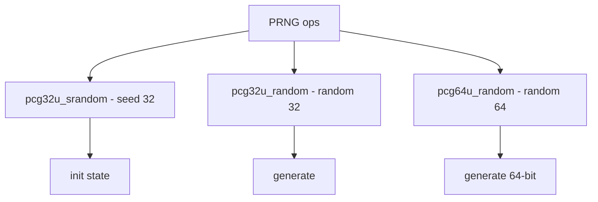

# Component: subr_prng.c

**Path:** `sys/kern/subr_prng.c`
**Type:** File
**Maps to:** `.discovery/sys/kern/subr_prng.md`

## Purpose

Pseudo-random number generator - PCG (Permuted Congruential Generator) implementation. Provides fast, high-quality random numbers for kernel use.

## Structure



## Key Functions

| Function | Purpose | Signature |
|----------|---------|-----------|
| `pcg32u_srandom_r` | Seed 32 | `void pcg32u_srandom_r(pcg32u_random_t *state, uint64_t seed)` |
| `pcg32u_random_r` | Random 32 | `uint32_t pcg32u_random_r(pcg32u_random_t *state)` |
| `pcg32u_boundedrand_r` | Bounded 32 | `uint32_t pcg32u_boundedrand_r(pcg32u_random_t *state, uint32_t bound)` |
| `pcg64u_srandom_r` | Seed 64 | `void pcg64u_srandom_r(pcg64u_random_t *state, uint64_t seed)` |
| `pcg64u_random_r` | Random 64 | `uint64_t pcg64u_random_r(pcg64u_random_t *state)` |

## PCG State

```c
typedef struct {
    uint64_t state;          // State
    uint64_t inc;           // Increment
} pcg32u_random_t;
```

## PCG 64-bit State

```c
typedef struct {
    pcg32u_random_t states[2]; // Two 32-bit
} pcg64u_random_t;
```

## Properties

| Property | Description |
|----------|-------------|
| `period` | 2^64 |
| `output` | PCG-XSH-RS |
| `seed` | 64-bit |

## Bounded Random

| Function | Range |
|----------|-------|
| `pcg32u_boundedrand_r` | 0 to bound-1 |
| `pcg64u_boundedrand_r` | 0 to bound-1 |

## Includes

- `sys/prng.h` - PRNG definitions

## Depends On

- `sys/pcpu.h` - Per-CPU