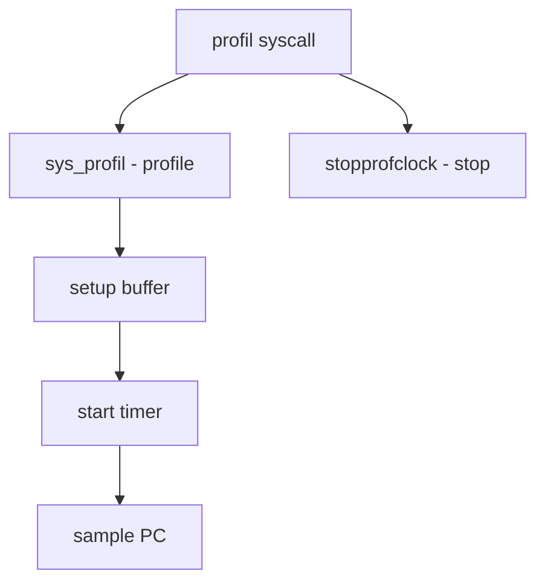

# Component: subr_prof.c

**Path:** `sys/kern/subr_prof.c`
**Type:** File
**Maps to:** `.discovery/sys/kern/subr_prof.md`

## Purpose

Kernel profiling - system call for CPU profiling. Samples PC at intervals using hardware counters.

## Structure



## Key Functions

| Function | Purpose | Signature |
|----------|---------|-----------|
| `sys_profil` | Profile syscall | `int sys_profil(struct thread *td, struct profil_args *uap)` |
| `stopprofclock` | Stop clock | `void stopprofclock(struct proc *p)` |

## Profil Args

```c
struct profil_args {
    caddr_t samples;      // Sample buffer
    size_t size;          // Buffer size
    size_t offset;        // Offset
    u_int scale;          // Scale
};
```

## Scale Factor

| Scale | Description |
|-------|-------------|
| `0` | Off |
| `0x10000` | 1.0 (1 PC per tick) |
| `>0x10000` | Higher resolution |

## Profiling Buffer

| Field | Description |
|-------|-------------|
| `samples` | PC buffer |
| `size` | Buffer size |
| `offset` | Text offset |
| `scale` | Scale factor |

## Sysctl

| Node | Description |
|------|-------------|
| `kern.proc.prof` | Process profiling |

## Use Cases

| Use | Description |
|-----|-------------|
| `gprof` | GNU profiler |
| `pmc` | Performance counters |

## Includes

- `sys/resourcevar.h` - Resource variables

## Depends On

- `machine/cpu.h` - CPU headers