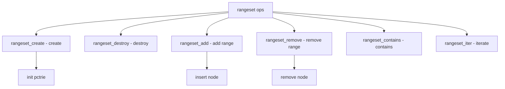

# Component: subr_rangeset.c

**Path:** `sys/kern/subr_rangeset.c`
**Type:** File
**Maps to:** `.discovery/sys/kern/subr_rangeset.md`

## Purpose

Range set - manages disjoint ranges of values. Uses PCTrie for efficient range operations, used for address space management.

## Structure



## Key Functions

| Function | Purpose | Signature |
|----------|---------|-----------|
| `rangeset_create` | Create | `struct rangeset *rangeset_create(struct lock_object *lock)` |
| `rangeset_destroy` | Destroy | `void rangeset_destroy(struct rangeset *rs)` |
| `rangeset_add` | Add range | `int rangeset_add(struct rangeset *rs, uintptr_t start, uintptr_t end)` |
| `rangeset_remove` | Remove | `int rangeset_remove(struct rangeset *rs, uintptr_t start, uintptr_t end)` |
| `rangeset_contains` | Contains | `bool rangeset_contains(struct rangeset *rs, uintptr_t start, uintptr_t end)` |
| `rangeset_empty` | Empty | `bool rangeset_empty(struct rangeset *rs)` |
| `rangeset_copy` | Copy | `int rangeset_copy(struct rangeset *dst, struct rangeset *src)` |

## Rangeset Structure

```c
struct rangeset {
    struct pctrie rs_pctrie;    // PCTrie
    struct lock_object *rs_lock; // Lock
};
```

## Range

```c
struct rs_range {
    uintptr_t start;           // Start
    uintptr_t end;             // End
};
```

## Operations

| Op | Description |
|----|-------------|
| `add` | Add range |
| `remove` | Remove range |
| `contains` | Check overlap |
| `empty` | Check empty |

## Use Cases

| Use | Description |
|-----|-------------|
| `vm_map` | VM address ranges |
| `device` | I/O ranges |

## Includes

- `sys/rangeset.h` - Rangeset definitions
- `sys/pctrie.h` - PCTrie

## Depends On

- `vm/uma.h` - Memory allocator