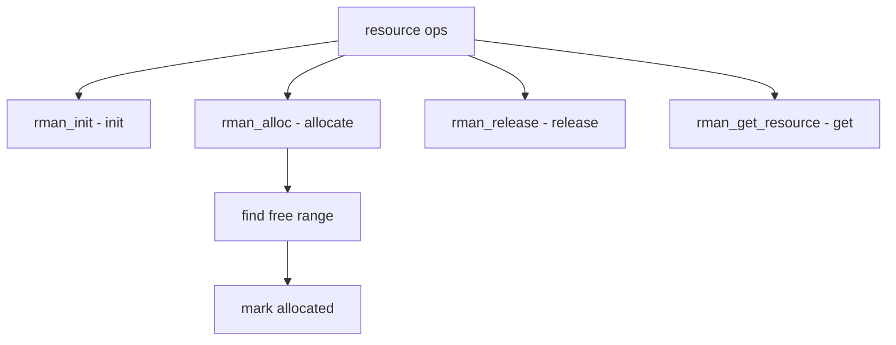

# Component: subr_rman.c

**Path:** `sys/kern/subr_rman.c`
**Type:** File
**Maps to:** `.discovery/sys/kern/subr_rman.md`

## Purpose

Resource manager - manages hardware resources (I/O ports, memory, IRQs). Provides allocation and release of resource ranges.

## Structure



## Key Functions

| Function | Purpose | Signature |
|----------|---------|-----------|
| `rman_init` | Init | `void rman_init(struct rman *rm)` |
| `rman_fini` | Finish | `void rman_fini(struct rman *rm)` |
| `rman_alloc` | Allocate | `int rman_alloc(struct rman *rm, u_long start, u_long end, ...)` |
| `rman_alloc_resource` | Alloc res | `struct resource *rman_alloc_resource(struct rman *rm, ...)` |
| `rman_release` | Release | `int rman_release(struct rman *rm, struct resource *r)` |
| `rman_get_resource` | Get res | `struct resource *rman_get_resource(struct rman *rm, int rid, ...)` |
| `rman_first_free` | First free | `u_long rman_first_free(struct rman *rm)` |

## Resource Structure

```c
struct resource {
    struct rman *r_rm;         // Manager
    int r_rid;                 // ID
    int r_type;                // Type
    int r_flags;               // Flags
    u_long r_start;           // Start
    u_long r_end;             // End
    void *r_dev;              // Device
};
```

## Rman Structure

```c
struct rman {
    u_long rm_start;           // Start
    u_long rm_end;             // End
    TAILQ_HEAD(, resource) rm_list; // List
    struct mtx rm_lock;       // Lock
};
```

## Resource Types

| Type | Description |
|------|-------------|
| `SYS_RES_IRQ` | IRQ |
| `SYS_RES_DRQ` | DMA |
| `SYS_RES_MEMORY` | Memory |
| `SYS_RES_IOPORT` | I/O port |

## Flags

| Flag | Description |
|------|-------------|
| `RF_SHAREABLE` | Shareable |
| `RF_TIMESHARE` | Time share |

## Includes

- `sys/rman.h` - Resource manager definitions

## Depends On

- `sys/lock.h` - Locking