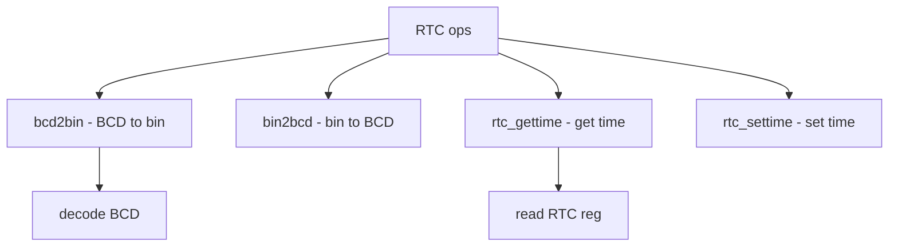

# Component: subr_rtc.c

**Path:** `sys/kern/subr_rtc.c`
**Type:** File
**Maps to:** `.discovery/sys/kern/subr_rtc.md`

## Purpose

RTC helpers - real-time clock support functions. Provides bcd2bin/bin2bcd conversion and RTC reading utilities for time-of-day clocks.

## Structure



## Key Functions

| Function | Purpose | Signature |
|----------|---------|-----------|
| `bcd2bin` | BCD to binary | `int bcd2bin(int bcd)` |
| `bin2bcd` | Binary to BCD | `int bin2bcd(int bin)` |
| `rtc_gettime` | Get time | `int rtc_gettime(struct timespec *ts)` |
| `rtc_settime` | Set time | `int rtc_settime(const struct timespec *ts)` |

## BCD Conversion

```c
bcd2bin(bcd)  = ((bcd) >> 4) * 10 + ((bcd) & 0xf)
bin2bcd(bin)  = (((bin) / 10) << 4) + ((bin) % 10)
```

## RTC Registers

| Register | Description |
|----------|-------------|
| `RTC_YEAR` | Year |
| `RTC_MONTH` | Month |
| `RTC_DAY` | Day |
| `RTC_HOUR` | Hour |
| `RTC_MIN` | Minute |
| `RTC_SEC` | Second |

## Clock Types

| Type | Description |
|------|-------------|
| `RTC` | CMOS RTC |
| `TOD` | Time of Day |

## Use Cases

| Use | Description |
|-----|-------------|
| `i386` | PC clock |
| `arm` | ARM RTC |

## Includes

- `sys/time.h` - Time definitions

## Depends On

- `sys/param.h` - Parameters