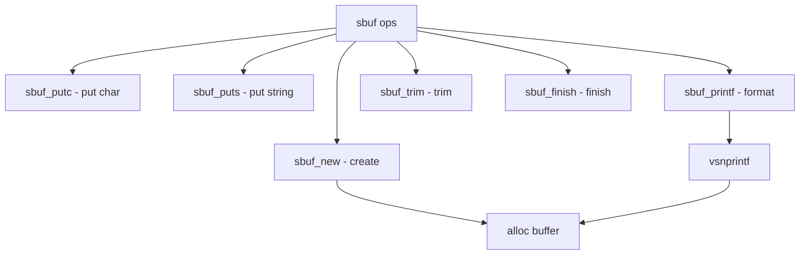

# Component: subr_sbuf.c

**Path:** `sys/kern/subr_sbuf.c`
**Type:** File
**Maps to:** `.discovery/sys/kern/subr_sbuf.md`

## Purpose

String buffer - dynamic string building. Provides sbuf_* functions for building formatted strings with automatic buffer management.

## Structure



## Key Functions

| Function | Purpose | Signature |
|----------|---------|-----------|
| `sbuf_new` | Create | `struct sbuf *sbuf_new(struct sbuf *s, char *buf, int length, int flags)` |
| `sbuf_delete` | Delete | `void sbuf_delete(struct sbuf *s)` |
| `sbuf_putc` | Put char | `int sbuf_putc(struct sbuf *s, int c)` |
| `sbuf_puts` | Put string | `int sbuf_puts(struct sbuf *s, const char *str)` |
| `sbuf_printf` | Printf | `int sbuf_printf(struct sbuf *s, const char *fmt, ...)` |
| `sbuf_vprintf` | Vprintf | `int sbuf_vprintf(struct sbuf *s, const char *fmt, va_list ap)` |
| `sbuf_trim` | Trim | `int sbuf_trim(struct sbuf *s)` |
| `sbuf_finish` | Finish | `int sbuf_finish(struct sbuf *s)` |
| `sbuf_data` | Get data | `char *sbuf_data(struct sbuf *s)` |
| `sbuf_len` | Get len | `int sbuf_len(struct sbuf *s)` |

## Sbuf Structure

```c
struct sbuf {
    char *s_buf;            // Buffer
    size_t s_size;         // Size
    size_t s_len;          // Len
    int s_flags;           // Flags
};
```

## Flags

| Flag | Description |
|------|-------------|
| `SBUF_FIXEDLEN` | Fixed len |
| `SBUF_DYNAMIC` | Dynamic |
| `SBUF_INCLUDENUL` | Include NUL |
| `SBUF_AUTOEXTEND` | Auto extend |

## Operations

| Op | Description |
|----|-------------|
| `putc` | Put char |
| `puts` | Put string |
| `printf` | Formatted print |
| `vprintf` | Varargs print |

## Use Cases

| Use | Description |
|-----|-------------|
| `sysctl` | Sysctl strings |
| `namei` | Path building |

## Includes

- `sys/sbuf.h` - Sbuf definitions

## Depends On

- `sys/malloc.h` - Memory allocation