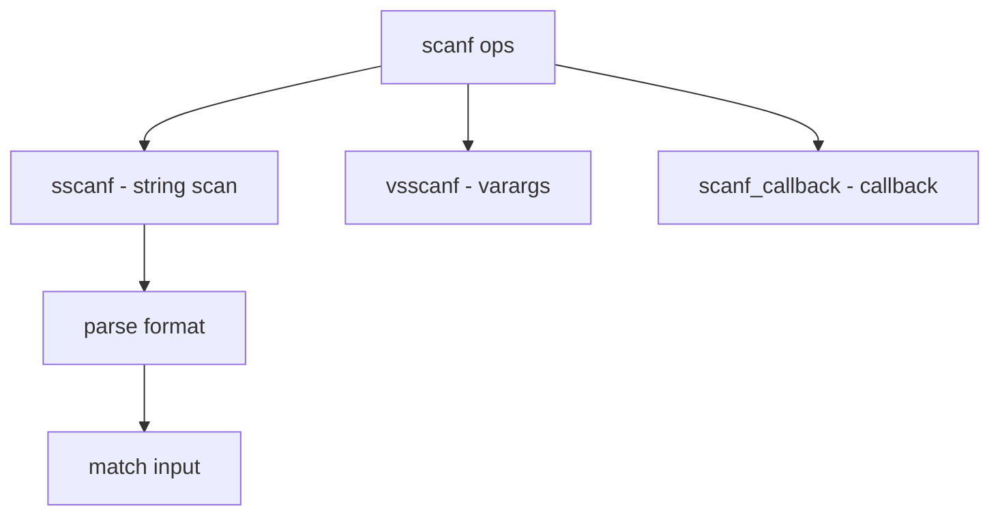

# Component: subr_scanf.c

**Path:** `sys/kern/subr_scanf.c`
**Type:** File
**Maps to:** `.discovery/sys/kern/subr_scanf.md`

## Purpose

Scanf - kernel implementation of sscanf, vsscanf. Parses formatted strings for kernel use.

## Structure

## Key Functions

| Function | Purpose | Signature |
|----------|---------|-----------|
| `sscanf` | Scan from string | `int sscanf(const char *str, const char *fmt, ...)` |
| `vsscanf` | Varargs | `int vsscanf(const char *str, const char *fmt, va_list ap)` |

## Conversion Flags

| Flag | Description |
|------|-------------|
| `LONG` | Long/double |
| `SHORT` | Short |
| `SUPPRESS` | Suppress assignment |
| `POINTER` | Pointer |
| `NOSKIP` | No skip blanks |
| `QUAD` | Quad |
| `INTMAXT` | intmax_t |
| `PTRDIFFT` | ptrdiff_t |
| `SIZET` | size_t |
| `SHORTSHORT` | char |

## Format Specifiers

| Spec | Description |
|------|-------------|
| `%d` | Decimal |
| `%u` | Unsigned |
| `%x` | Hex |
| `%s` | String |
| `%c` | Char |
| `%n` | Count |
| `%p` | Pointer |

## Includes

- `sys/stdarg.h` - Varargs
- `sys/ctype.h` - Character