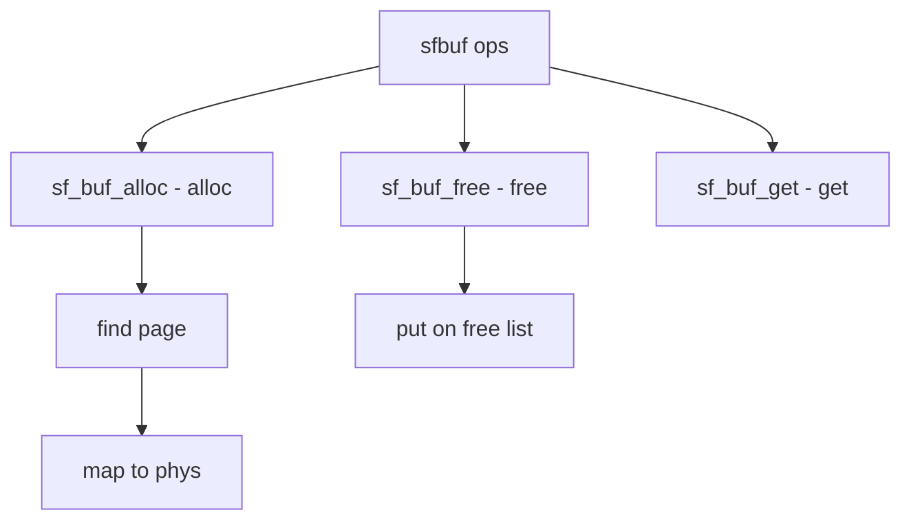

# Component: subr_sfbuf.c

**Path:** `sys/kern/subr_sfbuf.c`
**Type:** File
**Maps to:** `.discovery/sys/kern/subr_sfbuf.md`

## Purpose

Sendfile buffers - sf_buf management for sendfile(2). Maps VM pages for efficient network I/O without copying.

## Structure



## Key Functions

| Function | Purpose | Signature |
|----------|---------|-----------|
| `sf_buf_alloc` | Allocate | `struct sf_buf *sf_buf_alloc(struct vm_page *m, int flags)` |
| `sf_buf_free` | Free | `void sf_buf_free(struct sf_buf *sf)` |
| `sf_buf_get` | Get buffer | `struct sf_buf *sf_buf_get(struct vm_page *m, int flags)` |
| `sf_buf_map` | Map | `void *sf_buf_map(struct sf_buf *sf)` |
| `sf_buf_unmap` | Unmap | `void sf_buf_unmap(struct sf_buf *sf)` |

## SF Buf Structure

```c
struct sf_buf {
    TAILQ_ENTRY(sf_buf) list;    // List
    struct vm_page *page;       // Page
    vm_offset_t kva;            // KVA
};
```

## Sysctl

| Node | Description |
|------|-------------|
| `kern_ipc.nsfbufs` | Max buffers |
| `kern_ipc.nsfbufspeak` | Peak usage |
| `kern_ipc.nsfbufsused` | Current usage |

## Parameters

| Param | Default |
|-------|---------|
| `NSFBUFS` | 512 + maxusers * 16 |

## Use Cases

| Use | Description |
|-----|-------------|
| `sendfile` | Zero-copy send |
| `HTTP server` | Fast file serving |

## Includes

- `sys/sf_buf.h` - Sendfile buffer definitions

## Depends On

- `vm/vm_page.h` - VM page