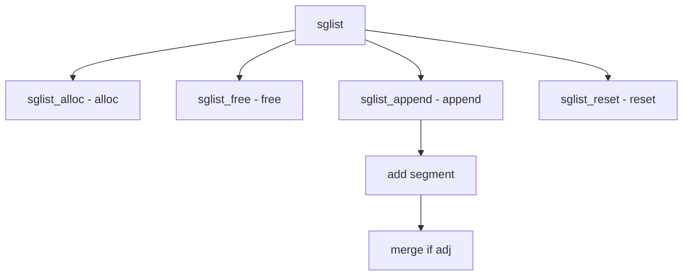

# Component: subr_sglist.c

**Path:** `sys/kern/subr_sglist.c`
**Type:** File
**Maps to:** `.discovery/sys/kern/subr_sglist.md`

## Purpose

Scatter-gather list - manages scatter-gather lists for DMA operations. Provides segments that describe memory regions.

## Structure



## Key Functions

| Function | Purpose | Signature |
|----------|---------|-----------|
| `sglist_alloc` | Allocate | `int sglist_alloc(struct sglist **sglp, int maxseg, int flags)` |
| `sglist_free` | Free | `void sglist_free(struct sglist *sg)` |
| `sglist_append` | Append | `int sglist_append(struct sglist *sg, void *buf, size_t len)` |
| `sglist_reset` | Reset | `void sglist_reset(struct sglist *sg)` |
| `sglist_count` | Count | `int sglist_count(struct sglist *sg)` |

## SGLIST Structure

```c
struct sglist {
    struct sglist_seg *sg_segs; // Segments
    int sg_maxseg;              // Max segments
    int sg_nseg;               // Num segments
    size_t sg_totlen;          // Total length
};
```

## SGLIST Segment

```c
struct sglist_seg {
    vm_offset_t ss_addr;      // Address
    size_t ss_len;           // Length
};
```

## Operations

| Op | Description |
|----|-------------|
| `append` | Add segment |
| `prepend` | Add at start |
| `reset` | Clear list |

## Use Cases

| Use | Description |
|-----|-------------|
| `DMA` | Bus DMA |
| `network` | Network buffers |

## Includes

- `sys/sglist.h` - Sglist definitions