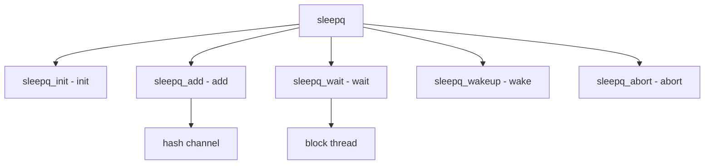

# Component: subr_sleepqueue.c

**Path:** `sys/kern/subr_sleepqueue.c`
**Type:** File
**Maps to:** `.discovery/sys/kern/subr_sleepqueue.md`

## Purpose

Sleep queues - thread blocking on wait channels. Provides sleep/wakeup mechanism with timeout and signal interruption.

## Structure



## Key Functions

| Function | Purpose | Signature |
|----------|---------|-----------|
| `sleepq_init` | Init | `void sleepq_init(void)` |
| `sleepq_add` | Add | `void sleepq_add(void *chan, struct lock_object *lock, const char *wmesg, int priority)` |
| `sleepq_wait` | Wait | `void sleepq_wait(void *chan, int pri)` |
| `sleepq_wakeup` | Wakeup | `void sleepq_wakeup(void *chan)` |
| `sleepq_abort` | Abort | `void sleepq_abort(struct thread *td, int sig)` |

## Sleep Queue

```c
struct sleepqueue {
    TAILQ_ENTRY(sleepqueue) sq_link;     // Link
    void *sq_channel;                    // Channel
    struct thread *sq_fifo[];           // Waiters
};
```

## Hash Table

| Size | Description |
|------|-------------|
| `SLEEPQ_HASH_SIZE` | Hash size |
| `SLEEPQ_HASH` | Hash function |

## Features

| Feature | Description |
|---------|-------------|
| `timeout` | Timed sleep |
| `signal` | Interruptible |
| `hash` | Channel hash |

## Use Cases

| Use | Description |
|-----|-------------|
| `sleep` | Sleep/wakeup |
| `cv` | Condition variables |

## Includes

- `sys/sleepqueue.h` - Sleepqueue definitions