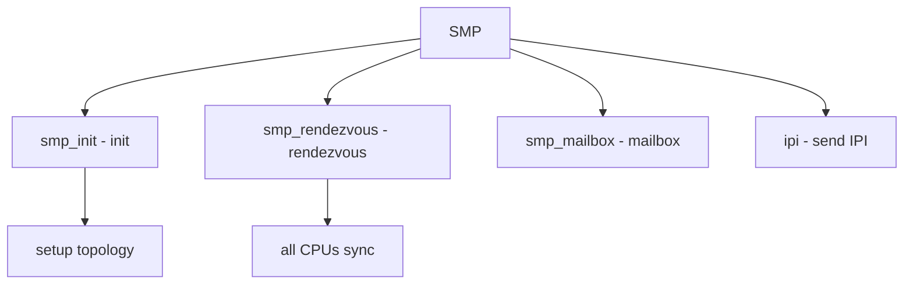

# Component: subr_smp.c

**Path:** `sys/kern/subr_smp.c`
**Type:** File
**Maps to:** `.discovery/sys/kern/subr_smp.md`

## Purpose

SMP support - Symmetric Multi-Processor support functions. Manages CPU topology, cache domains, and cross-CPU operations.

## Structure



## Key Functions

| Function | Purpose | Signature |
|----------|---------|-----------|
| `smp_init` | Init | `void smp_init(void)` |
| `smp_rendezvous` | Rendezvous | `void smp_rendezvous(void (*func)(void *), void *arg)` |
| `smp_rendezvous_lock` | Locked rendez | `void smp_rendezvous_lock(void (*func)(void *), void *arg)` |
| `smp_no_rendezvous` | No rendez | `void smp_no_rendezvous(void)` |

## CPU Group

```c
struct cpu_group {
    u_int cg_parent;          // Parent
    u_int cg_children;       // Children
    u_int cg_count;          // Count
    u_int cg_mask[];        // Mask
};
```

## Topology

| Type | Description |
|------|-------------|
| `SMP_Topology` | CPU topology |
| `cache_domain` | Cache domain |

## IPI Types

| Type | Description |
|------|-------------|
| `IPI_RENDEZVOUS` | Rendezvous |
| `IPI_STOP` | Stop CPU |
| `IPI_SHOOTDOWN` | Shootdown |

## Includes

- `sys/smp.h` - SMP definitions
- `machine/smp.h` - Machine SMP