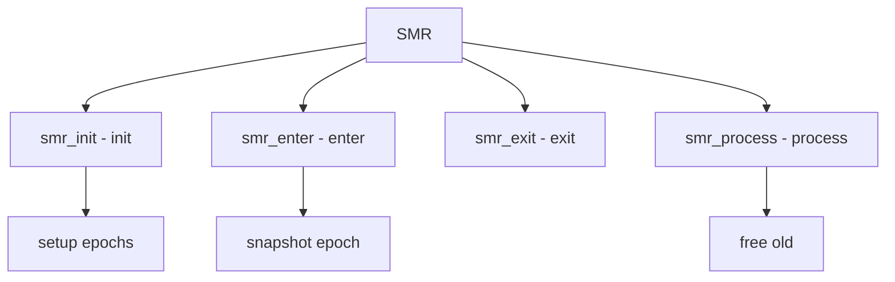

# Component: subr_smr.c

**Path:** `sys/kern/subr_smr.c`
**Type:** File
**Maps to:** `.discovery/sys/kern/subr_smr.md`

## Purpose

Safe Memory Reclamation (SMR) - provides lock-free memory reclamation using epoch-based approach. Allows safe freeing of objects in concurrent data structures.

## Structure



## Key Functions

| Function | Purpose | Signature |
|----------|---------|-----------|
| `smr_init` | Init | `void smr_init(struct smr *smr)` |
| `smr_enter` | Enter SMR | `void smr_enter(struct smr *smr)` |
| `smr_exit` | Exit SMR | `void smr_exit(struct smr *smr)` |
| `smr_wait` | Wait | `void smr_wait(struct smr *smr)` |
| `smr_process` | Process | `void smr_process(struct smr *smr)` |

## SMR Structure

```c
struct smr {
    uint64_t smr_epoch;          // Epoch
    TAILQ_HEAD(, smr_entry) smr_list; // Deferred
};
```

## SMR Entry

```c
struct smr_entry {
    TAILQ_ENTRY(smr_entry) se_link;
    void (*se_free)(void *);    // Free func
    void *se_ptr;              // Pointer
};
```

## Features

| Feature | Description |
|---------|-------------|
| `lock-free` | No locks for read |
| `epoch` | Epoch-based |
| `deferred` | Deferred free |

## Use Cases

| Use | Description |
|-----|-------------|
| `lockless` | Lock-free structures |
| `RCU` | Similar to Linux RCU |

## Includes

- `sys/smr.h` - SMR definitions