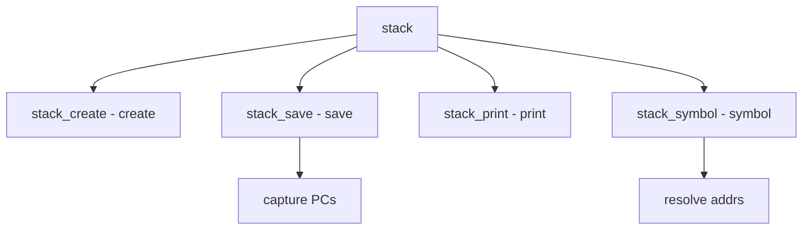

# Component: subr_stack.c

**Path:** `sys/kern/subr_stack.c`
**Type:** File
**Maps to:** `.discovery/sys/kern/subr_stack.md`

## Purpose

Kernel stack tracing - captures and manages kernel stack traces. Provides functions to capture and print stack backtraces.

## Structure



## Key Functions

| Function | Purpose | Signature |
|----------|---------|-----------|
| `stack_create` | Create | `struct stack *stack_create(int flags)` |
| `stack_delete` | Delete | `void stack_delete(struct stack *st)` |
| `stack_save` | Save | `void stack_save(struct stack *st)` |
| `stack_print` | Print | `void stack_print(struct stack *st)` |
| `stack_print_ddb` | Print DDB | `void stack_print_ddb(struct stack *st)` |
| `stack_symbol` | Symbol | `int stack_symbol(vm_offset_t pc, char *namebuf, u_int buflen, long *offset)` |

## Stack Structure

```c
struct stack {
    int st_depth;                    // Depth
    vm_offset_t st_pc[STACK_MAX];  // PCs
};
```

## Flags

| Flag | Description |
|------|-------------|
| `STACK_PRETTY` | Pretty print |

## Constants

| Constant | Description |
|----------|-------------|
| `STACK_MAX` | Max depth |

## Use Cases

| Use | Description |
|-----|-------------|
| `debug` | Stack traces |
| `panic` | Panic output |

## Includes

- `sys/stack.h` - Stack definitions