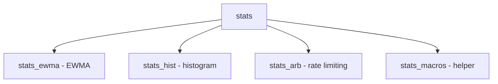

# Component: subr_stats.c

**Path:** `sys/kern/subr_stats.c`
**Type:** File
**Maps to:** `.discovery/sys/kern/subr_stats.md`

## Purpose

Statistics framework - provides data structures for tracking measurements (histograms, EWMA, counters). Used for network and system metrics.

## Structure



## Key Structures

| Structure | Description |
|-----------|-------------|
| `struct stats_ewma` | EWMA |
| `struct stats_hist` | Histogram |
| `struct stats_arb` | Rate limiter |

## EWMA (Exponentially Weighted Moving Average)

```c
struct stats_ewma {
    uint64_t val;         // Value
    int int_per_sec;      // Intervals
    double coeff;        // Coefficient
};
```

## Histogram

```c
struct stats_hist_bucket {
    uint64_t count;
    uint64_t lower;
    uint64_t upper;
};

struct stats_hist {
    struct stats_hist_bucket *buckets;
    int nBuckets;
};
```

## ARB (Adaptive Rate Limiter)

```c
struct stats_arb {
    uint64_t rate;          // Rate
    uint64_t burst;        // Burst
};
```

## Functions

| Function | Description |
|----------|-------------|
| `stats_ewma_init` | Init EWMA |
| `stats_ewma_update` | Update |
| `stats_hist_init` | Init histogram |

## Includes

- `sys/stats.h` - Stats definitions
- `sys/arb.h` - ARB definitions