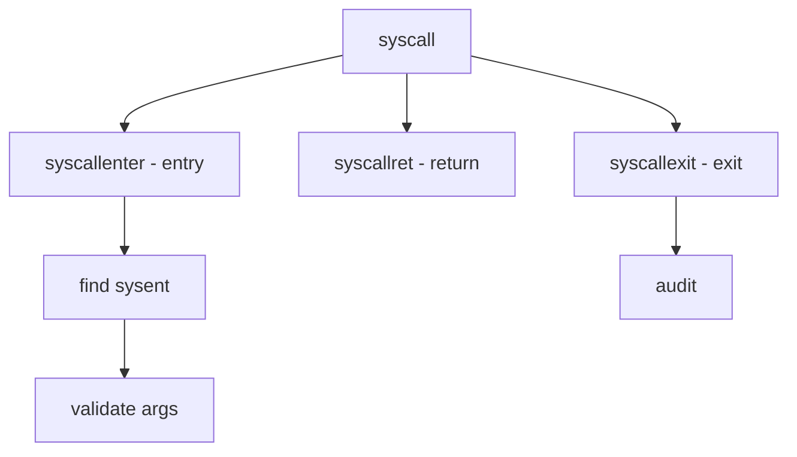

# Component: subr_syscall.c

**Path:** `sys/kern/subr_syscall.c`
**Type:** File
**Maps to:** `.discovery/sys/kern/subr_syscall.md`

## Purpose

System call handling - entry/exit points for system calls. Handles syscall dispatch and tracing.

## Structure



## Key Functions

| Function | Purpose | Signature |
|----------|---------|-----------|
| `syscallenter` | Entry | `void syscallenter(struct thread *td)` |
| `syscallret` | Return | `void syscallret(struct thread *td, int error)` |
| `syscallexit` | Exit | `void syscallexit(struct thread *td)` |
| `trace` | Trace | `void trace(int code, int *args)` |

## Syscall Args

```c
struct syscall_args {
    u_int code;              // Number
    register_t *args;        // Args
    struct sysent *sy_call; // Function
};
```

## Sysent

```c
struct sysent {
    int sy_narg;           // Args
    struct sysent *sy_call; // Func
    sy_ ## ## ##;         // Val
};
```

## Tracing

| Feature | Description |
|---------|-------------|
| `ktrace` | Kernel trace |
| `audit` | Audit |

## Includes

- `sys/sysent.h` - Sysent definitions
- `security/audit/audit.h` - Audit