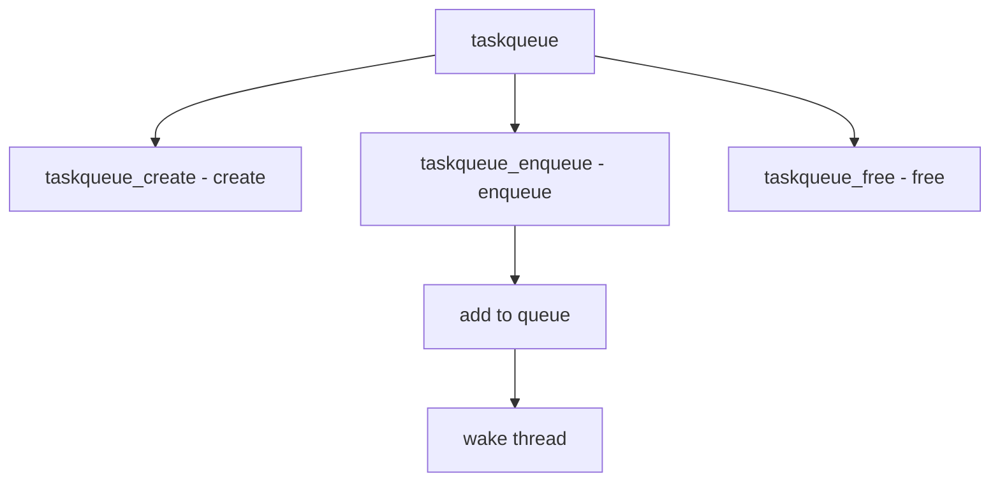

# Component: subr_taskqueue.c

**Path:** `sys/kern/subr_taskqueue.c`
**Type:** File
**Maps to:** `.discovery/sys/kern/subr_taskqueue.md`

## Purpose

Taskqueue - deferred task execution. Provides mechanism to queue tasks for later execution by dedicated threads.

## Structure



## Key Functions

| Function | Purpose | Signature |
|----------|---------|-----------|
| `taskqueue_create` | Create | `struct taskqueue *taskqueue_create(const char *name, int mflags, ...)` |
| `taskqueue_free` | Free | `void taskqueue_free(struct taskqueue *tq)` |
| `taskqueue_enqueue` | Enqueue | `int taskqueue_enqueue(struct taskqueue *tq, struct task *task)` |
| `TASK_INIT` | Init task | `void TASK_INIT(struct task *task, int flags, task_fn_t *fn, void *context)` |
| `TASKQUEUE_FAST` | Fast queue | `TASKQUEUE_FAST_DECLARE(fast)` |

## Task Structure

```c
struct task {
    TAILQ_ENTRY(task) ta_link;     // Link
    int ta_pending;                // Pending
    task_fn_t *ta_fn;            // Func
    void *ta_context;            // Context
};
```

## Types

| Type | Description |
|------|-------------|
| `TASKQUEUE_SWI` | SWI |
| `TASKQUEUE_FAST` | Fast |
| `TASKQUEUE_THREAD` | Thread |

## Task Flags

| Flag | Description |
|------|-------------|
| `TASK_ENQ` | Enqueue |

## Includes

- `sys/taskqueue.h` - Taskqueue definitions