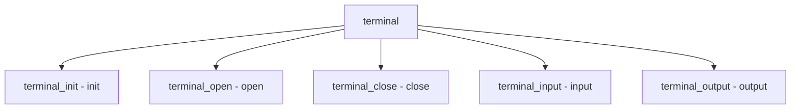

# Component: subr_terminal.c

**Path:** `sys/kern/subr_terminal.c`
**Type:** File
**Maps to:** `.discovery/sys/kern/subr_terminal.md`

## Purpose

Terminal management - terminal device abstraction. Provides terminal layer between TTY and console drivers.

## Structure



## Key Functions

| Function | Purpose | Signature |
|----------|---------|-----------|
| `terminal_init` | Init | `void terminal_init(void)` |
| `terminal_open` | Open | `int terminal_open(struct terminal *tm, struct terminal_ops *ops)` |
| `terminal_close` | Close | `int terminal_close(struct terminal *tm)` |
| `terminal_input` | Input | `void terminal_input(struct terminal *tm, const char *buf, size_t len)` |
| `terminal_output` | Output | `size_t terminal_output(struct terminal *tm, const char *buf, size_t len)` |

## Terminal Structure

```c
struct terminal {
    struct terminal_ops *tm_ops;  // Ops
    void *tm_private;            // Private
    struct tty *tm_tty;         // TTY
    int tm_flags;               // Flags
};
```

## Terminal Ops

```c
struct terminal_ops {
    int (*t_op_backspace)(struct terminal *);
    int (*t_op_close)(struct terminal *);
    ssize_t (*t_op_write)(struct terminal *, const void *, size_t);
};
```

## Flags

| Flag | Description |
|------|-------------|
| `TF_CONS` | Console |
| `TF_WINDOWS` | Windows |

## Includes

- `sys/terminal.h` - Terminal definitions
- `sys/tty.h` - TTY definitions