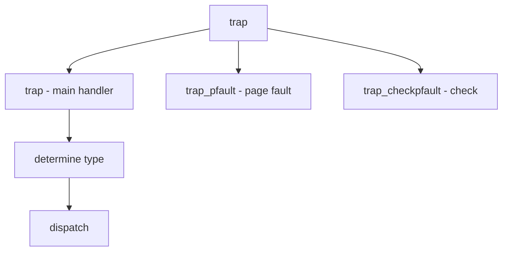

# Component: subr_trap.c

**Path:** `sys/kern/subr_trap.c`
**Type:** File
**Maps to:** `.discovery/sys/kern/subr_trap.md`

## Purpose

Trap handling - architecture-independent trap/fault handling. Dispatches page faults, system calls, and other traps.

## Structure

## Key Functions

| Function | Purpose | Signature |
|----------|---------|-----------|
| `trap` | Main trap | `void trap(struct trapframe *frame)` |
| `trap_pfault` | Page fault | `void trap_pfault(struct trapframe *frame, vm_offset_t va, int ftype)` |

## Trap Types

| Type | Description |
|------|-------------|
| `T_PROTFLT` | Protection |
| `T_TSSFLT` | TSS fault |
| `T_STACKFLT` | Stack fault |

## Fault Types

| Type | Description |
|------|-------------|
| `VM_PROT_READ` | Read fault |
| `VM_PROT_WRITE` | Write fault |
| `VM_PROT_EXEC` | Execute |

## Use Cases

| Use | Description |
|-----|-------------|
| `pagefault` | Memory faults |
| `syscall` | System calls |
| `interrupt` | Interrupts |

## Includes

- `sys/proc.h` - Process definitions
- `sys/systm.h` - System definitions