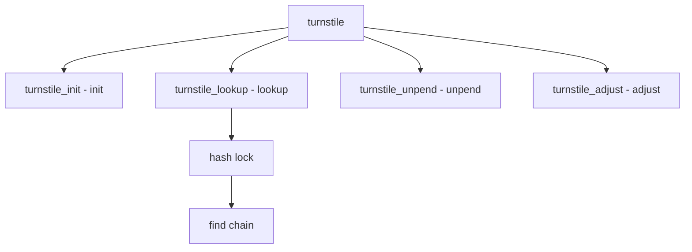

# Component: subr_turnstile.c

**Path:** `sys/kern/subr_turnstile.c`
**Type:** File
**Maps to:** `.discovery/sys/kern/subr_turnstile.md`

## Purpose

Turnstiles - priority inheritance for blocking on non-sleepable locks. Manages thread queues for locks with priority propagation.

## Structure



## Key Functions

| Function | Purpose | Signature |
|----------|---------|-----------|
| `turnstile_init` | Init | `void turnstile_init(void)` |
| `turnstile_lookup` | Lookup | `struct turnstile *turnstile_lookup(void *lock)` |
| `turnstile_unpend` | Unpend | `struct thread *turnstile_unpend(struct turnstile *ts)` |
| `turnstile_adjust` | Adjust | `void turnstile_adjust(struct thread *td)` |
| `turnstile_free` | Free | `void turnstile_free(struct turnstile *ts)` |

## Turnstile Structure

```c
struct turnstile {
    TAILQ_ENTRY(turnstile) ts_link;       // Link
    void *ts_lockobj;                    // Lock
    struct thread *ts_owner;             // Owner
    TAILQ_HEAD(, thread) ts_waiters;    // Waiters
};
```

## Priority Inheritance

| Feature | Description |
|---------|-------------|
| `propagation` | Inherit priority |
| `lending` | Lend priority |

## Hash Table

| Size | Description |
|------|-------------|
| `TURNSTILE_HASH_SIZE` | Hash size |

## Use Cases

| Use | Description |
|-----|-------------|
| `mutex` | Mutex waits |
| `sx` | Shared/exclusive |

## Includes

- `sys/turnstile.h` - Turnstile definitions