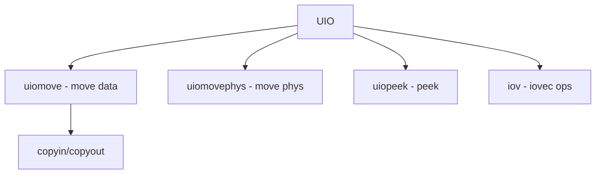

# Component: subr_uio.c

**Path:** `sys/kern/subr_uio.c`
**Type:** File
**Maps to:** `.discovery/sys/kern/subr_uio.md`

## Purpose

UIO (User I/O) - scatter-gather I/O operations. Providesuiomove() for copying data between kernel and user space.

## Structure



## Key Functions

| Function | Purpose | Signature |
|----------|---------|-----------|
| `uiomove` | Move data | `int uiomove(void *cp, int n, struct uio *uio)` |
| `uiomovephys` | Move phys | `int uiomovephys(void *cp, int n, struct uio *uio)` |
| `uiopeek` | Peek | `int uiopeek(struct uio *uio, struct iovec *iovp)` |
| `iovnlen` | IoV len | `int iovnlen(struct iovec *iovp, int iovcnt)` |

## UIO Structure

```c
struct uio {
    struct iovec *uio_iov;    // Iov
    int uio_iovcnt;           // Count
    off_t uio_offset;        // Offset
    enum uio_seg uio_segflg; // Segment
    enum uio_rw uio_rw;      // Direction
    struct thread *uio_td;   // Thread
};
```

## Iovec

```c
struct iovec {
    void *iov_base;           // Base
    size_t iov_len;          // Length
};
```

## Segment Flags

| Flag | Description |
|------|-------------|
| `UIO_USERSPACE` | User space |
| `UIO_SYSSPACE` | Kernel space |

## Direction

| Dir | Description |
|-----|-------------|
| `UIO_READ` | Read |
| `UIO_WRITE` | Write |

## Includes

- `sys/uio.h` - UIO definitions