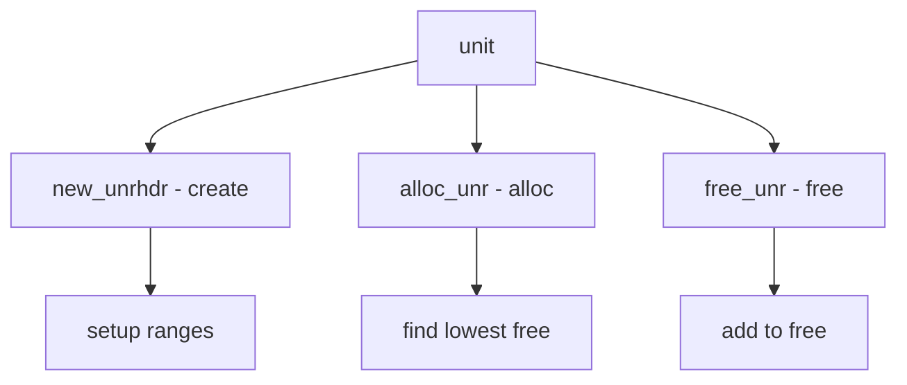

# Component: subr_unit.c

**Path:** `sys/kern/subr_unit.c`
**Type:** File
**Maps to:** `.discovery/sys/kern/subr_unit.md`

## Purpose

Unit number allocator - allocates device unit numbers from a range. Uses run-length encoding with bitmap for efficiency.

## Structure



## Key Functions

| Function | Purpose | Signature |
|----------|---------|-----------|
| `new_unrhdr` | Create | `struct unrhdr *new_unrhdr(int low, int high, struct mtx *lock)` |
| `alloc_unr` | Allocate | `int alloc_unr(struct unrhdr *uh)` |
| `alloc_unrl` | Alloc locked | `int alloc_unrl(struct unrhdr *uh)` |
| `free_unr` | Free | `void free_unr(struct unrhdr *uh, int unit)` |

## UNR Header

```c
struct unrhdr {
    int uh_low;              // Low
    int uh_high;            // High
    struct mtx *uh_lock;   // Lock
    TAILQ_HEAD(, unref) uh_freelist; // Free list
};
```

## Allocation

| Property | Description |
|----------|-------------|
| `lowest` | Always lowest free |
| `no sleep` | Never sleeps |
| `compact` | Low memory |

## Use Cases

| Use | Description |
|-----|-------------|
| `device` | Device unit numbers |
| `unit` | Generic unit allocation |

## Includes

- `sys/libkern.h` - Kernel lib