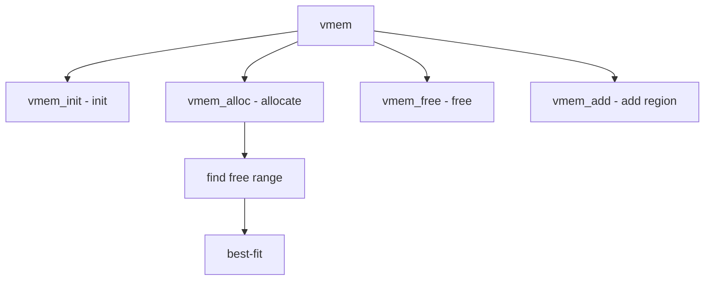

# Component: subr_vmem.c

**Path:** `sys/kern/subr_vmem.c`
**Type:** File
**Maps to:** `.discovery/sys/kern/subr_vmem.md`

## Purpose

Virtual memory allocator - manages kernel virtual address spaces. Provides vmem(9) for allocating virtual address ranges.

## Structure



## Key Functions

| Function | Purpose | Signature |
|----------|---------|-----------|
| `vmem_init` | Init | `void vmem_init(vmem_t *vm, const char *name, vm_offset_t start, vm_offset_t end)` |
| `vmem_alloc` | Allocate | `int vmem_alloc(vmem_t *vm, size_t size, int flags, vm_offset_t *addr)` |
| `vmem_free` | Free | `void vmem_free(vmem_t *vm, vm_offset_t addr, size_t size)` |
| `vmem_add` | Add region | `int vmem_add(vmem_t *vm, vm_offset_t start, size_t size, int flags)` |
| `vmem_realloc` | Reallocate | `int vmem_realloc(vmem_t *vm, vm_offset_t *addr, size_t oldsize, size_t newsize, int flags)` |

## Vmem Structure

```c
struct vmem {
    const char *vm_name;           // Name
    vm_offset_t vm_start;          // Start
    vm_offset_t vm_end;           // End
    TAILQ_HEAD(, vmem_seg) vm_segs; // Segments
    struct mtx vm_lock;          // Lock
};
```

## Vmem Segment

```c
struct vmem_seg {
    TAILQ_ENTRY(vmem_seg) vs_link;   // Link
    vm_offset_t vs_start;           // Start
    vm_offset_t vs_end;             // End
    int vs_type;                    // Type
};
```

## Flags

| Flag | Description |
|------|-------------|
| `VMEM_FLAGS` | Allocation flags |

## Use Cases

| Use | Description |
|-----|-------------|
| `KVA` | Kernel virtual |
| `address` | Address space |

## Includes

- `sys/vmem.h` - Vmem definitions