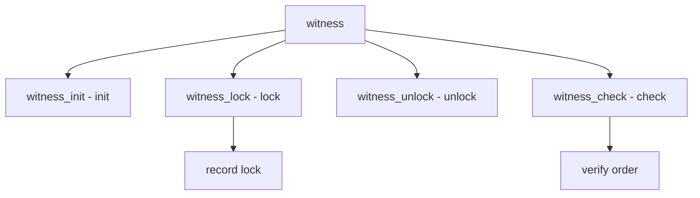

# Component: subr_witness.c

**Path:** `sys/kern/subr_witness.c`
**Type:** File
**Maps to:** `.discovery/sys/kern/subr_witness.md`

## Purpose

Witness lock verifier - detects lock order inversions and deadlocks. Verifies that locks are acquired in the correct order.

## Structure



## Key Functions

| Function | Purpose | Signature |
|----------|---------|-----------|
| `witness_init` | Init | `void witness_init(void)` |
| `witness_register` | Register | `void witness_register(struct lock_object *lock, ...)` |
| `witness_lock` | Lock | `void witness_lock(struct lock_object *lock, ...)` |
| `witness_unlock` | Unlock | `void witness_unlock(struct lock_object *lock)` |
| `witness_check` | Check | `void witness_check(struct lock_object *lock, ...)` |

## Lock Order

| Feature | Description |
|---------|-------------|
| `order` | Lock order |
| `graph` | Wait-for graph |
| `detect` | Deadlock detection |

## Options

| Option | Description |
|--------|-------------|
| `WITNESS` | Enable |
| `WITNESS_DBDUMP` | Dump on warn |
| `WITNESS_KDB` | KDB on error |

## Include Chains

```c
struct lock_list {
    TAILQ_ENTRY lock_list) ll_link;
    struct lock_object *ll_lock;
};
```

## Use Cases

| Use | Description |
|-----|-------------|
| `debug` | Lock debugging |
| `kernel` | Lock verification |

## Includes

- `sys/witness.h` - Witness definitions