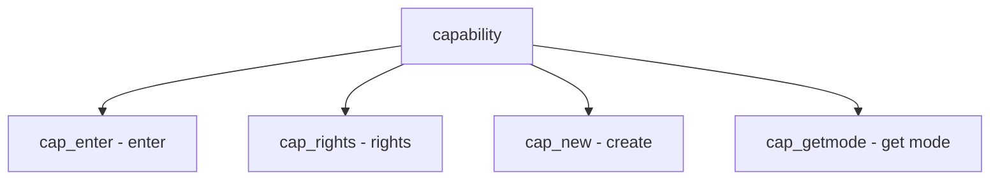

# Component: sys_capability.c

**Path:** `sys/kern/sys_capability.c`
**Type:** File
**Maps to:** `.discovery/sys/kern/sys_capability.md`

## Purpose

Capability mode - Capsicum sandboxing for processes. Provides capability mode and delegated file descriptors.

## Structure

## Key Functions

| Function | Purpose | Signature |
|----------|---------|-----------|
| `cap_enter` | Enter mode | `int cap_enter(void)` |
| `cap_getmode` | Get mode | `int cap_getmode(void)` |
| `cap_rights_init` | Init rights | `void cap_rights_init(cap_rights_t *rightsp, ...)` |
| `cap_rights_is_set` | Check rights | `bool cap_rights_is_set(const cap_rights_t *rightsp, ...)` |

## Capability Rights

| Right | Description |
|-------|-------------|
| `CAP_READ` | Read |
| `CAP_WRITE` | Write |
| `CAP_EXEC` | Execute |
| `CAP_LOOKUP` | Lookup |

## Mode

| Mode | Description |
|------|-------------|
| `0` | Normal |
| `1` | Capability |

## Features

| Feature | Description |
|---------|-------------|
| `sandbox` | Capability mode |
| `rights` | FD rights |

## Includes

- `sys/capsicum.h` - Capsicum definitions