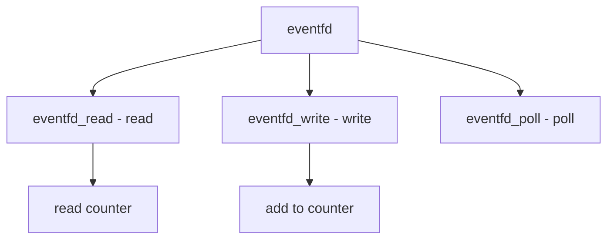

# Component: sys_eventfd.c

**Path:** `sys/kern/sys_eventfd.c`
**Type:** File
**Maps to:** `.discovery/sys/kern/sys_eventfd.md`

## Purpose

Eventfd - Linux-compatible eventfd for kernel/user notification. Provides a file descriptor for signaling events.

## Structure



## Key Functions

| Function | Purpose | Signature |
|----------|---------|-----------|
| `eventfd_read` | Read | `int eventfd_read(struct file *fp, struct uio *uio, int flags)` |
| `eventfd_write` | Write | `int eventfd_write(struct file *fp, struct uio *uio, int flags)` |
| `eventfd_poll` | Poll | `int eventfd_poll(struct file *fp, int events)` |
| `eventfd_ioctl` | Ioctl | `int eventfd_ioctl(struct file *fp, u_long cmd, void *data)` |

## Flags

| Flag | Description |
|------|-------------|
| `EFD_CLOEXEC` | Close on exec |
| `EFD_NONBLOCK` | Non-blocking |
| `EFD_SEMAPHORE` | Semaphore |

## Structure

```c
struct eventfd {
    uint64_t efd_count;         // Counter
    struct mtx efd_mtx;       // Mutex
    struct selinfo efd_sel;    // Select
    int efd_flags;            // Flags
};
```

## Use Cases

| Use | Description |
|-----|-------------|
| `sync` | Kernel/user sync |
| `notification` | Event notification |

## Includes

- `sys/eventfd.h` - Eventfd definitions