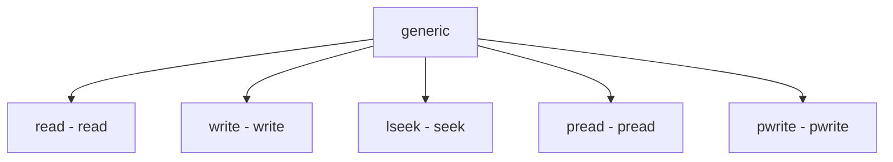

# Component: sys_generic.c

**Path:** `sys/kern/sys_generic.c`
**Type:** File
**Maps to:** `.discovery/sys/kern/sys_generic.md`

## Purpose

Generic I/O syscalls - read, write, lseek, pread, pwrite, and other file descriptor operations.

## Structure

## Key Functions

| Function | Purpose | Signature |
|----------|---------|-----------|
| `sys_read` | Read | `int sys_read(struct thread *td, struct read_args *uap)` |
| `sys_write` | Write | `int sys_write(struct thread *td, struct write_args *uap)` |
| `sys_lseek` | Seek | `int sys_lseek(struct thread *td, struct lseek_args *uap)` |
| `sys_pread` | Pread | `int sys_pread(struct thread *td, struct pread_args *uap)` |
| `sys_pwrite` | Pwrite | `int sys_pwrite(struct thread *td, struct pwrite_args *uap)` |

## I/O Operations

| Op | Description |
|----|-------------|
| `read` | Read from fd |
| `write` | Write to fd |
| `lseek` | Seek position |

## Use Cases

| Use | Description |
|-----|-------------|
| `io` | Generic I/O |

## Includes

- `sys/sysproto.h` - System prototypes