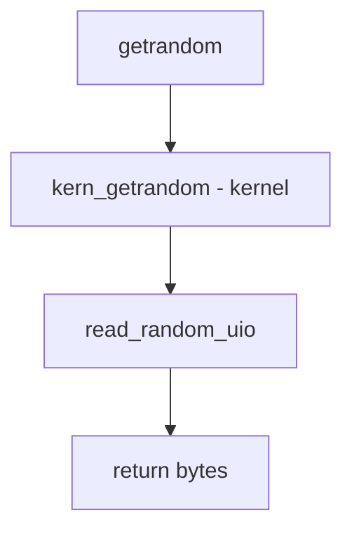

# Component: sys_getrandom.c

**Path:** `sys/kern/sys_getrandom.c`
**Type:** File
**Maps to:** `.discovery/sys/kern/sys_getrandom.md`

## Purpose

Getrandom - Linux-compatible getrandom syscall. Provides cryptographically secure random bytes from the kernel.

## Structure



## Key Functions

| Function | Purpose | Signature |
|----------|---------|-----------|
| `kern_getrandom` | Kernel impl | `int kern_getrandom(struct thread *td, void *user_buf, size_t buflen, unsigned int flags)` |

## Flags

| Flag | Description |
|------|-------------|
| `GRND_NONBLOCK` | Non-blocking |
| `GRND_RANDOM` | Use /dev/random |
| `GRND_INSECURE` | Insecure |

## Valid Flags

```c
#define GRND_VALIDFLAGS (GRND_NONBLOCK | GRND_RANDOM | GRND_INSECURE)
```

## Use Cases

| Use | Description |
|-----|-------------|
| `entropy` | Cryptographic random |
| `syscall` | Linux compat |

## Includes

- `sys/random.h` - Random definitions