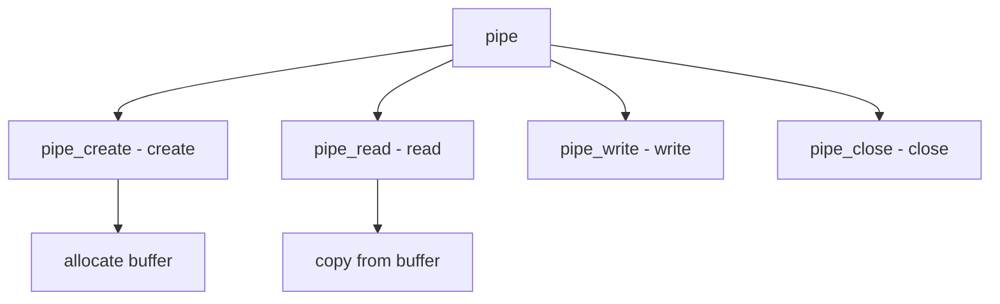

# Component: sys_pipe.c

**Path:** `sys/kern/sys_pipe.c`
**Type:** File
**Maps to:** `.discovery/sys/kern/sys_pipe.md`

## Purpose

Pipe - high-performance pipe implementation. Provides bidirectional data channel between processes with zero-copy for large writes.

## Structure

## Key Functions

| Function | Purpose | Signature |
|----------|---------|-----------|
| `pipe_create` | Create | `int pipe_create(struct pipe **pipeto, struct pipe **pipefrom)` |
| `pipe_read` | Read | `int pipe_read(struct file *fp, struct uio *uio, int flags)` |
| `pipe_write` | Write | `int pipe_write(struct file *fp, struct uio *uio, int flags)` |
| `pipe_close` | Close | `int pipe_close(struct file *fp)` |
| `pipe_poll` | Poll | `int pipe_poll(struct file *fp, int events)` |

## Pipe Modes

| Mode | Description |
|------|-------------|
| `small` | Kernel buffer |
| `large` | Direct I/O |

## Direct I/O

| Threshold | Description |
|-----------|-------------|
| `PIPE_MINDIRECT` | Direct threshold |
| `PIPE_SIZE` | Max size |

## Sysctl

| Node | Description |
|------|-------------|
| `kern.ipc.maxpipekva` | Max KVA |
| `kern.ipc.pipekva` | Current KVA |

## Includes

- `sys/pipe.h` - Pipe definitions