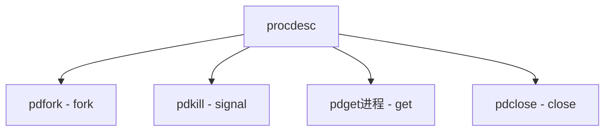

# Component: sys_procdesc.c

**Path:** `sys/kern/sys_procdesc.c`
**Type:** File
**Maps to:** `.discovery/sys/kern/sys_procdesc.md`

## Purpose

Process descriptor facility - represents processes as file descriptors for capability-based process management.

## Structure

## Key Functions

| Function | Purpose | Signature |
|----------|---------|-----------|
| `pdfork` | Fork with fd | `int pdfork(struct thread *td, int *fdp, int flags)` |
| `pdkill` | Signal | `int pdkill(struct thread *td, struct pdkill_args *uap)` |
| `pdget进程` | Get info | `int pdget进程(struct thread *td, struct pdget进程_args *uap)` |
| `pdclose` | Close | `int pdclose(struct file *fp)` |

## Properties

| Property | Description |
|----------|-------------|
| `PDEXEC` | Execute |
| `PD_CLOEXEC` | Close on exec |

## Semantics

| Rule | Description |
|------|-------------|
| `1:1` | One descriptor per process |
| `last close` | SIGKILL process |
| `exit before close` | No SIGCHLD |

## Use Cases

| Use | Description |
|-----|-------------|
| `capability` | Capability-based |
| `descriptor` | Process as fd |

## Includes

- `sys/procdesc.h` - Process descriptor definitions