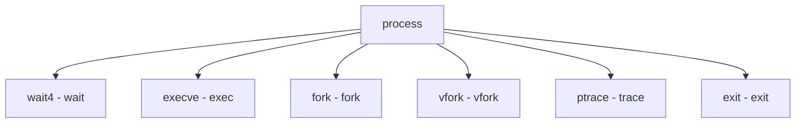

# Component: sys_process.c

**Path:** `sys/kern/sys_process.c`
**Type:** File
**Maps to:** `.discovery/sys/kern/sys_process.md`

## Purpose

Process-related syscalls - wait4, exec, ptrace, fork, exit operations.

## Structure

## Key Functions

| Function | Purpose | Signature |
|----------|---------|-----------|
| `sys_wait4` | Wait | `int sys_wait4(struct thread *td, struct wait4_args *uap)` |
| `sys_execve` | Exec | `int sys_execve(struct thread *td, struct execve_args *uap)` |
| `sys_fork` | Fork | `int sys_fork(struct thread *td, struct fork_args *uap)` |
| `sys_vfork` | Vfork | `int sys_vfork(struct thread *td, struct vfork_args *uap)` |
| `sys_ptrace` | Ptrace | `int sys_ptrace(struct thread *td, struct ptrace_args *uap)` |
| `sys_exit` | Exit | `void sys_exit(int rval)` |

## Options

| Option | Description |
|--------|-------------|
| `WNOHANG` | Non-blocking |
| `WUNTRACED` | Stopped |

## Use Cases

| Use | Description |
|-----|-------------|
| `process` | Process mgmt |
| `debug` | Debugging |

## Includes

- `sys/proc.h` - Process definitions
- `sys/ptrace.h` - Ptrace definitions