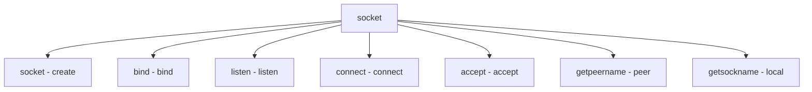

# Component: sys_socket.c

**Path:** `sys/kern/sys_socket.c`
**Type:** File
**Maps to:** `.discovery/sys/kern/sys_socket.md`

## Purpose

Socket syscalls - BSD socket API implementation. Provides socket(), connect(), accept(), listen(), bind() syscalls.

## Structure

## Key Functions

| Function | Purpose | Signature |
|----------|---------|-----------|
| `socket` | Create | `int socket(struct thread *td, struct socket_args *uap)` |
| `bind` | Bind | `int bind(struct thread *td, struct bind_args *uap)` |
| `listen` | Listen | `int listen(struct thread *td, struct listen_args *uap)` |
| `connect` | Connect | `int connect(struct thread *td, struct connect_args *uap)` |
| `accept` | Accept | `int accept(struct thread *td, struct accept_args *uap)` |
| `getsockname` | Get name | `int getsockname(struct thread *td, struct getsockname_args *uap)` |
| `getpeername` | Get peer | `int getpeername(struct thread *td, struct getpeername_args *uap)` |

## Socket Types

| Type | Description |
|------|-------------|
| `SOCK_STREAM` | Stream |
| `SOCK_DGRAM` | Datagram |
| `SOCK_RAW` | Raw |

## Protocols

| Proto | Description |
|-------|-------------|
| `PF_INET` | IPv4 |
| `PF_INET6` | IPv6 |
| `PF_UNIX` | Unix |

## Socket Options

| Option | Description |
|--------|-------------|
| `SO_REUSEADDR` | Reuse |
| `SO_REUSEPORT` | Reuse port |

## Includes

- `sys/socket.h` - Socket definitions
- `sys/socketvar.h` - Socket var